# 第一周作业

## R8-1

将下列十进制数化为二进制数和八进制数：（小数点后保留4位即可）49  ， 53  ，  7.943 ， 79.43

==十进制转化为二进制或八进制方法（带小数部分）==

**整数部分：**

​	整数部分无论是配凑还是利用除法都可以做到，简单

**小数部分：**

​	计算方法：	

​		用十进制小数乘以目标进制的基数（Radix），例如转二进制就乘 $2$，转八进制就乘 $8$。

​		将乘积结果的**整数部分**取出，作为目标进制小数的**第一位**。

​		将乘积结果的**小数部分**保留，继续重复步骤 $1$ 和 $2$，得到下一位目标进制的小数。

​		重复此过程，直到小数部分为 $0$，或达到所需的精度（本题要求保留 $4$ 位）。

​		将取出的整数部分按顺序排列，就是转换后的目标进制小数。

​	原理解释：

​		假设一个 $R$ 进制的小数表示为 $0.d_1 d_2 d_3 \dots$，其中 $d_i$ 是 $R$ 进制的数字（对于二进制， $R=2$ 且 $d_i \in \{0, 1\}$；对于八进制， $R=8$ 且 $d_i \in \{0, 1, \dots, 7\}$）。

这个 $R$ 进制小数的十进制值可以表示为：

$$D = d_1 \cdot R^{-1} + d_2 \cdot R^{-2} + d_3 \cdot R^{-3} + \dots$$

现在，我们用基数 $R$ 乘以这个十进制值 $D$：

$$\begin{aligned} D \times R &= (d_1 \cdot R^{-1} + d_2 \cdot R^{-2} + d_3 \cdot R^{-3} + \dots) \times R \\ &= d_1 \cdot R^0 + d_2 \cdot R^{-1} + d_3 \cdot R^{-2} + \dots \\ &= \mathbf{d_1} + (d_2 \cdot R^{-1} + d_3 \cdot R^{-2} + \dots)\end{aligned}$$

从上面的等式可以看出：

- 乘积的**整数部分**就是目标进制小数的**第一位**数字 $\mathbf{d_1}$。
- 乘积的**小数部分** $(d_2 \cdot R^{-1} + d_3 \cdot R^{-2} + \dots)$ 正好是剩下的、需要继续转换的部分。

因此，通过不断地乘以基数并取出整数部分，我们就能依次求出目标进制的每一位小数，这就是“乘基取整法”的数学原理。

# 第二周作业

## R2-3

**逻辑上的相邻：** 两个表达式中只有一位的取值不一样

# 第三周作业

## R2-5

==4-16译码器有十六个输出端口，故最少要四个2：4译码器，但是每个2：4译码器只能分辨两位的二进制输入，所以要扩充为4：16译码器，还需要一个2：4译码器充当地址译码==

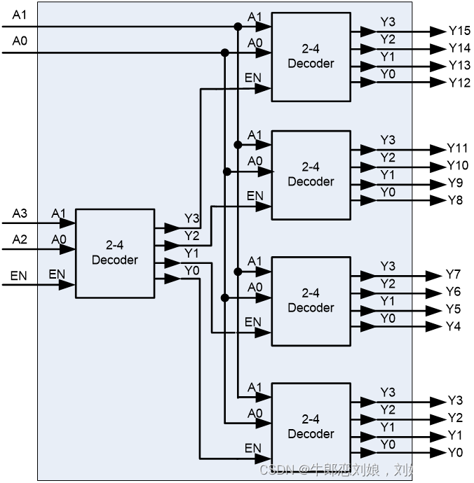

# 第五周作业

## R2-3

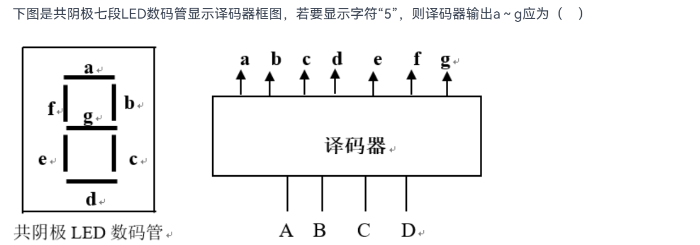

共阴极的LED管接地，要使得管亮得加高电平

# 期中小知识点汇总

## 第一章 开关理论基础

### §1.1数字系统

---

> #### 数字电路特点：
>
> **1) 二值信号，抗干扰能力强，保密性好；**
>
> **2) 通用性强，具有极强的信息处理和控制能力；**

---

> #### 数字电路两种运算：
>
> **1) 数的算术运算；**
>
> **2) 逻辑（控制）运算；**

---

### §1.2数制与码制

---

> $$数字系统编码\begin{cases} BCD码（只有十个编码组）(有权码,无权码)\\ 可靠性编码(格雷码，奇偶校验码) \end{cases}$$
>
> **ASCII 码** **（用7位二进制数进行编码）**

---

>#### 有权8421码调整原则：
>
>因为存在冗余码，于是**有进位或出现冗余码（和＞9）时, +6调整（判九加六）。**

---

> #### 有权2421码优点：
>
> 不允许出现0101~1010六种状态（冗余码），是对九的自补码，执行十进制加法的时候，**能正确地产生进位信号**

---

> #### 无权余三码：
>
> 将8421码都加0011，是一种**无权码**，有六个冗余码（前三个后三个），**也能够正确产生十进制进位信号**

---

> #### 循环码（格雷码）的可靠性：
>
> 多种编码方案，相邻的两个代码只有1位取值不同。减少传输错误。
>
> 格雷码的运算规则（8421码—>格雷码）：
>
> $$\begin{cases} G_{n-1} = B_{n-1} & 最高位相等 \\ G_i = B_i \bigoplus B_{i+1} &0 \le i \le n-2 其他位取与高位的异或（模二加）\end{cases}$$

---

> #### 奇偶校验码的组成和特点：
>
> 组成：
>
> $$校验码\begin{cases}信息位 & ——位数不限\\ 校验位 &——仅1位\end{cases}$$
>
> 编码方式：
>
> $$编码方式\begin{cases}奇校验 & 检验码中的权重为奇数\\ 偶校验 & 校验码中的权重为偶数 \end{cases}$$
>
> 特点：
>
> **(1) 编码简单、容易实现 ；** 
>
> **(2) 奇偶检验码只有检错能力，没有纠错能力 ；** 
>
> **(3) 只能发现单错，不能发现双错**

---

### §1.3逻辑函数及其描述工具

---

> #### 异或电路的特殊功能：
>
> 奇偶检验——输入变量有奇数个1的时候输出为1，否则为0
>
> 下图为异或电路实现8421码和格雷码的互相转变
>
> 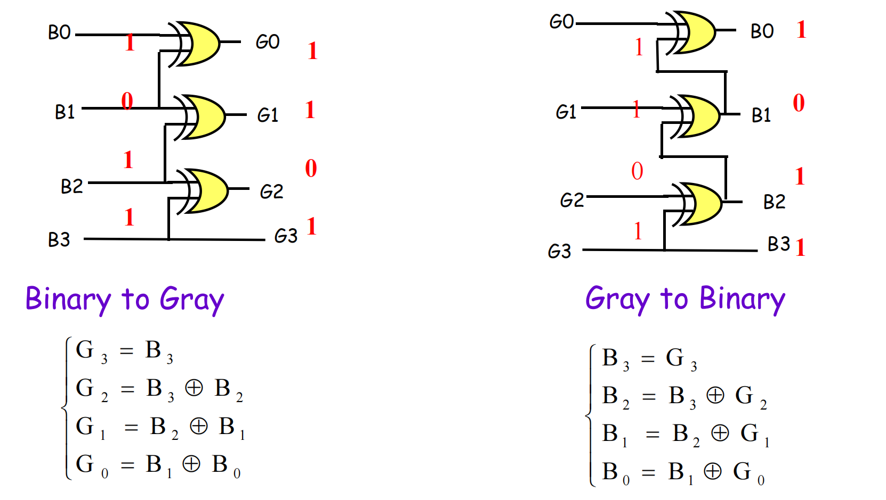

---

> #### 对偶规则：
>
> 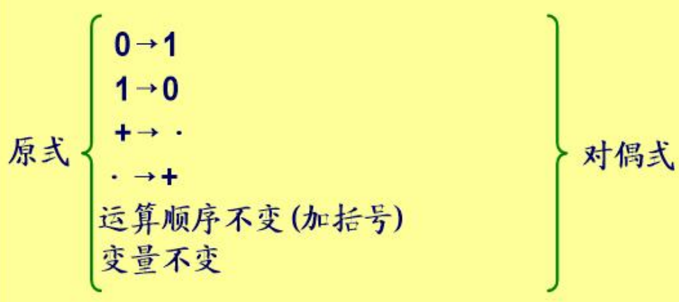
>
> 对偶规则的应用：
>
> **证明等式成立**——**若两个逻辑函数相等，则它们的对偶式也相等**

---

> #### 真值表求最小项：
>
> 逻辑函数可表示为唯一的最小项表达式，使函数值为1的最小项相加

---

## 第二章 组合逻辑电路

### 组合逻辑电路特点：

- 各种门电路组合而成
- 无记忆原件
- 无反馈通路
- **不具有记忆保持功能**，输出值与当前输入有关，与电路前一时刻的状态无关

---

### §2.1组合逻辑分析

> #### 分析逻辑电路的一般思路：找出输出函数与输入变量的逻辑关系
>
> 电路图 $\Longrightarrow$ 化简逻辑表达式（与或式）$\Longrightarrow$ 列出真值表$\Longrightarrow$ 指出逻辑功能

---

### §2.2组合逻辑的设计

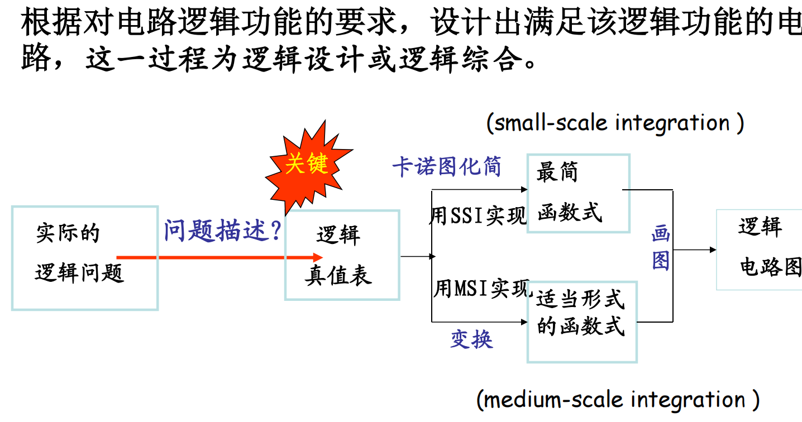

---

### §2.4数据选择器与分配器

---

> #### 数据选择器MUX的应用：
>
> 可以直接通过真值表最小项来进行输出
>
> 也可以使用卡诺图实现组合逻辑：
>
> 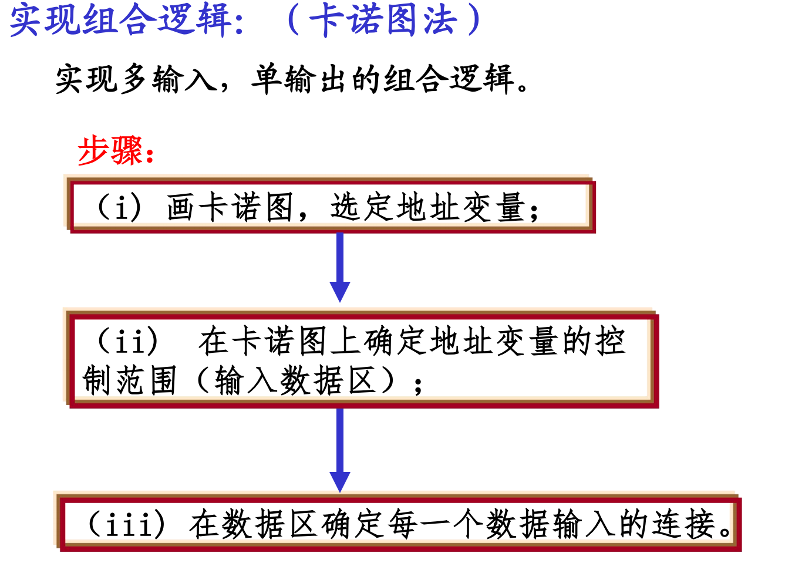
>
> 例如四个变量ABCD,可以把AB放在地址输入端，CD放在数据输入端然后使用卡诺图：
>
> | **AB\CD** | **00** | **01** | **11** | **10** |                    |
> | --------- | ------ | ------ | ------ | ------ | ------------------ |
> | **00**    | 1      | 1      |        |        | 这一行为D~0~输出端 |
> | **01**    |        |        |        |        | 这一行为D~1~输出端 |
> | **11**    |        |        |        |        | 这一行为D~2~输出端 |
> | **10**    |        |        |        |        | 这一行为D~3~输出端 |
>
> 上面的卡诺图要化简只能在同行之间画圈
>
> 比如第一行可以化为D~0~ = $\overline{C}$

---

> #### 数据选择器的特点：
>
> 1. 有使能输入
> 2. 地址线公用
> 3. 源码输入
> 4. 可执行并行到串行的输出转换（如下图）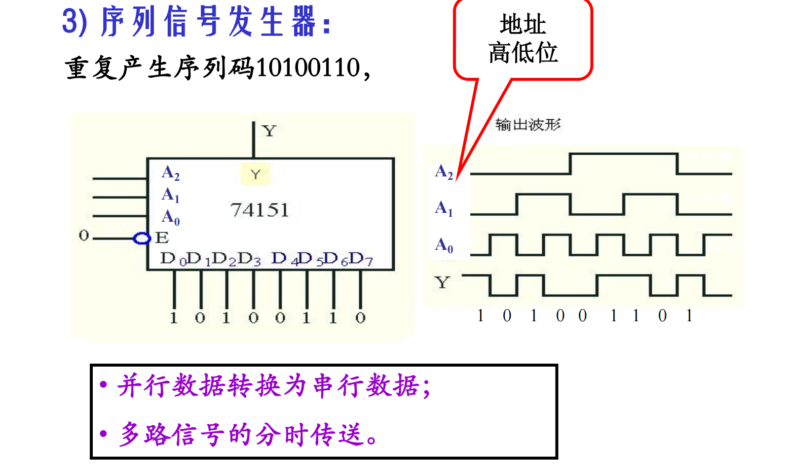
> 5. 可用作多输入，单输出的函数发生器

---

> #### 数据分配器DEMUX特点：
>
> 将一路数据分配到多路装置中，由地址输入决定输出通路
>
> 有效端输出为低电平

---

### §2.5译码器和编码器

---

> #### 常用译码器：
>
> - 二进制译码器
> - 二—十译码器
> - 七段显示译码器

---

> #### 二进制译码器：
>
> 从2^n^位的信息中译出一个有效信息

---

> #### ==3:8译码器74LS138（唯一要记）==：
>
> 输入端：使能端和地址端
>
> 输出端：低电平有效
>
> 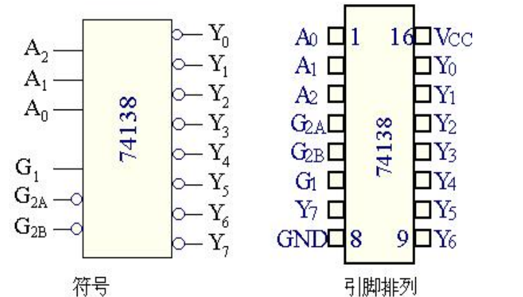
>
> ==**译码器的输出端对应一个最小项的非。**==

---

> #### 译码器的应用：
>
> 1. 提供片选：
>
> 如下图所示，2-4译码器用来提供片选，设计结构为：
>
> 2^2^ $\rightarrow$ 4, 2^4^ $\rightarrow$ 32,其中第一个2：4译码器即为提供片选
>
> 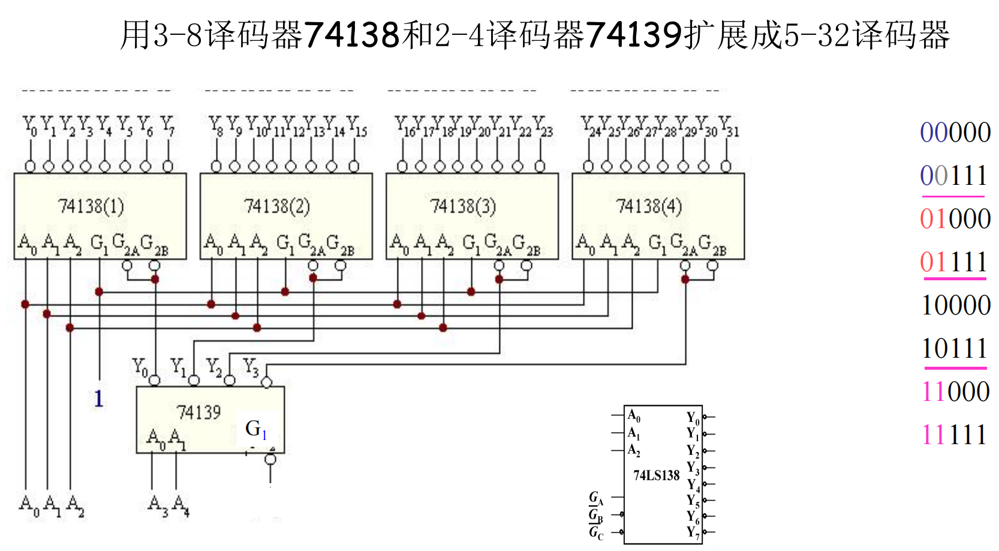
>
> 2. 地址译码
>
> 如下图，用十位来选择外设，一般前三位接使能（一般来说前三位是固定逻辑），后面几位由译码器决定由哪个输出端接外设
>
> 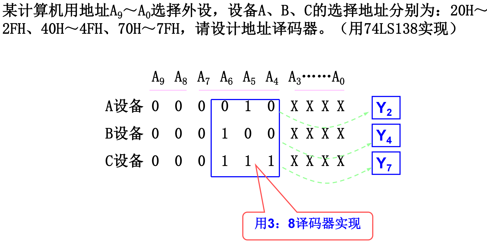
>
> 3. 实现逻辑函数
>
> 因为译码器的每个输出端都可以表示一个最小项的非，于是可以通过最小项式子来直接实现多输出的组合逻辑电路，无需化简过程，且此时一般n个地址端的译码器可实现最多n个变量的逻辑函数
>
> 4. 译码器做数据分配器
>
> 如下图，右边的38译码器由G~{2B}~作为数据端，同时作为使能端，如果Y为1则都为1，不工作；如果Y为0则工作，此时他们的地址端公用，保证了每个数据输入能够从一样的端口输出
>
> 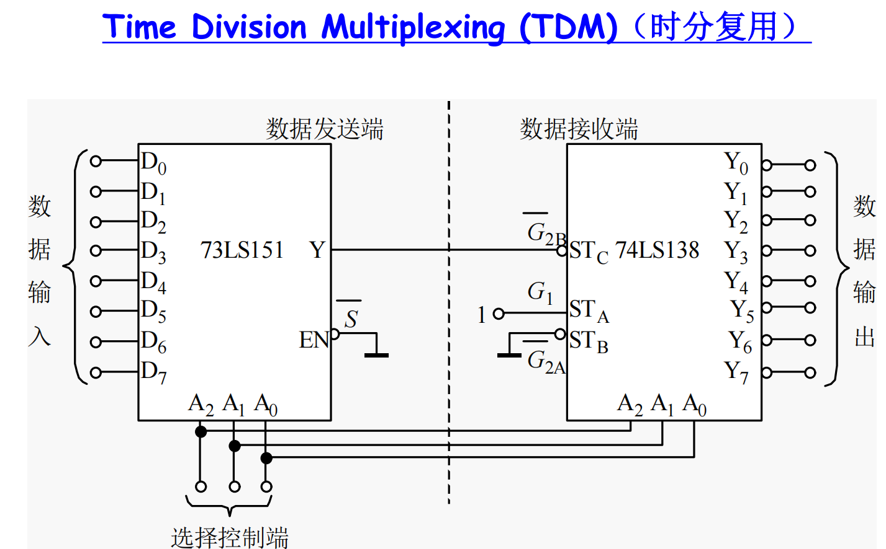
>
> 5. 作为二进制数等值比较器
>
> 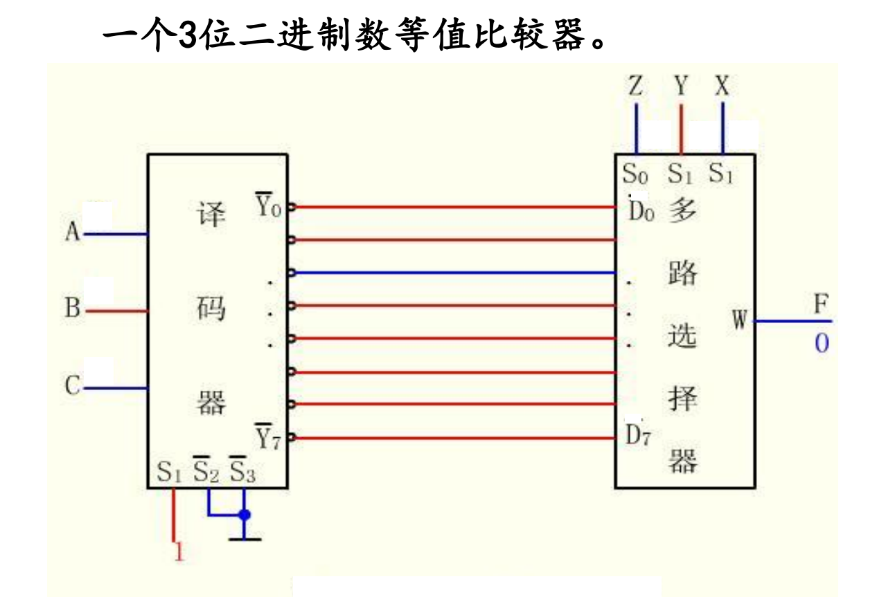

---

> #### 二进制编码器：
>
> 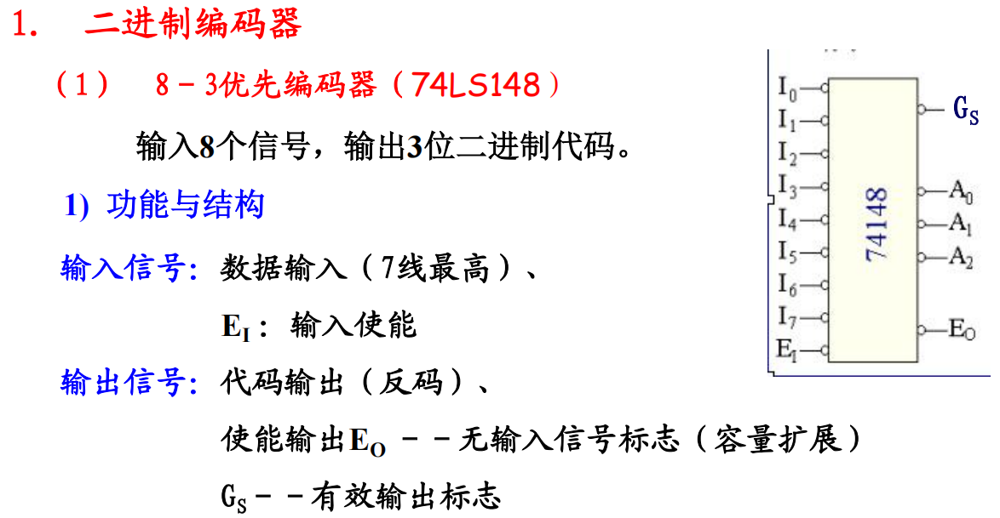
>
> 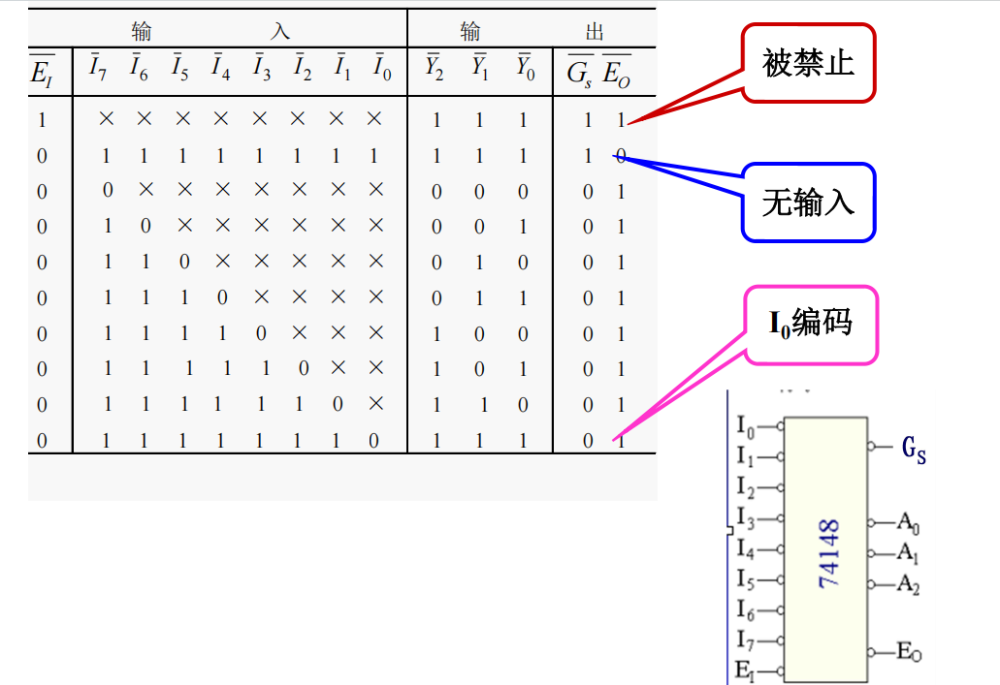**特点**：
>
> - 高位优先编码
> - 反码输出
> - 有使能输入，输出
> - 有输出有效标志

---

### §2.5数值比较器和加法器

---

> #### 数值比较器：
>
> 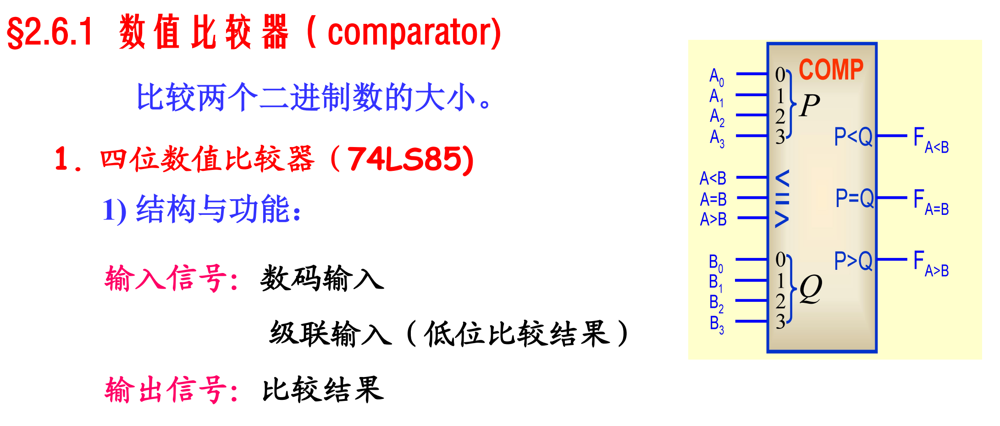
>
> 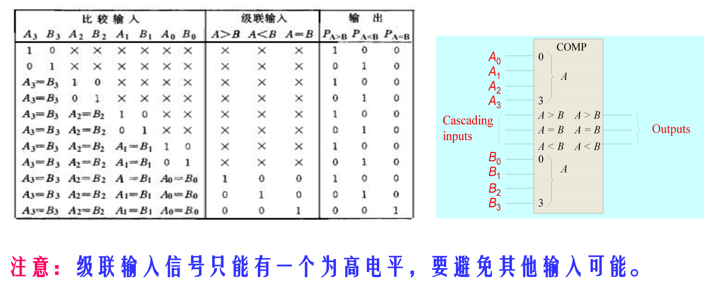
>
> 级联的时候注意：
>
> 低位应该先比较，因为比较器是优先在当前比较的时候输出大小关系，只有在相等的情况下才会看级联输入信号，且最低位的级联输入接固定信号： A>B和A<B接0，A=B接1，相当于高位相等（即不存在的高位都为0）

---

### §组合逻辑电路的竞争冒险

---

> #### 险象产生的原因：
>
> **竞争**：同一信号经不同路径到达输出门有时间差的现象
>
> **冒险**：当有竞争能力的信号发生**变化**时，可能使电路产生了暂时错误输出

---

> #### 竞争冒险——逻辑冒险：
>
> ==只有一个变量产生变化的时候出现的冒险==
>
> **”1“冒险——互补的与信号**：
>
> 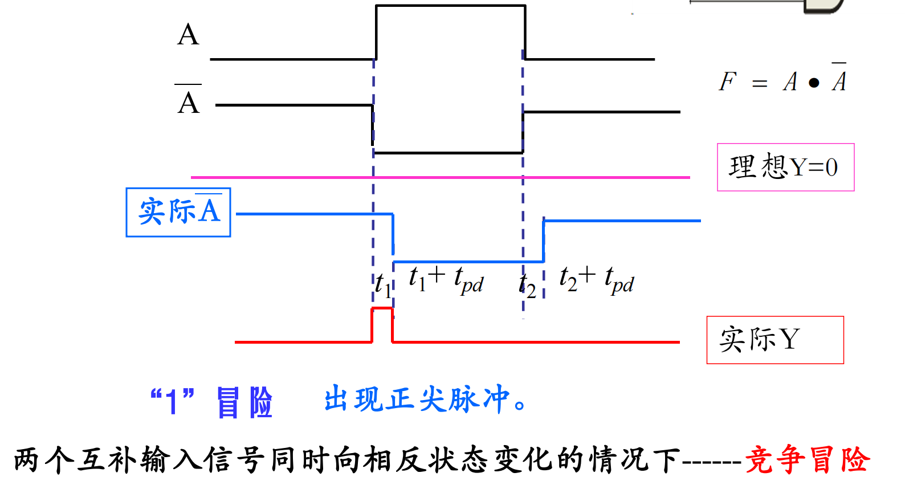
>
> **“0”冒险——互补的或信号：**
>
> 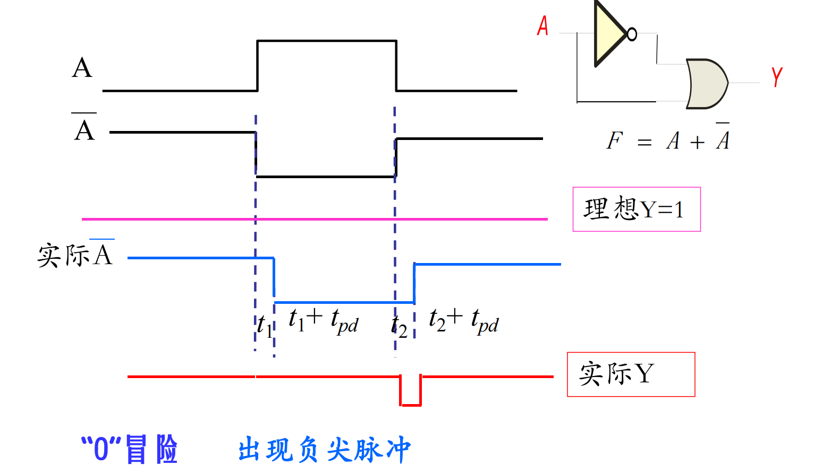

---

> #### 竞争冒险——逻辑冒险：
>
> ==当有两个或两个以上输入信号同时产生**变化**时，在输出端产生毛刺==
>
> 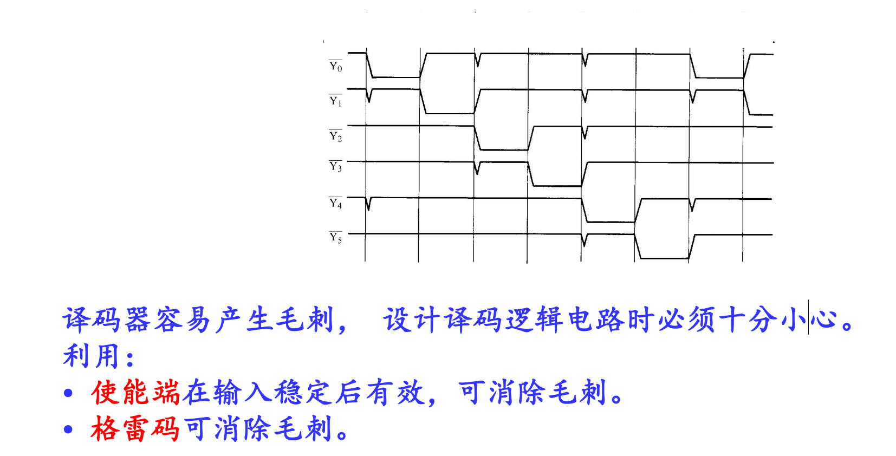

