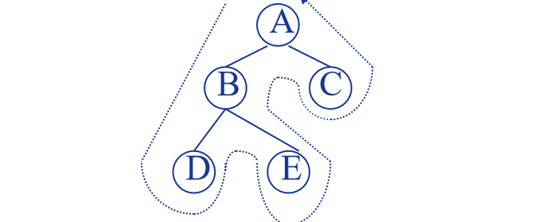

# 数据结构


## 第一章-绪论

---

### 第一部分：数据的逻辑结构与存储结构（选择/判断题高频）

这部分主要考“概念混淆”，请务必分清**逻辑**和**物理（存储）**的区别。

#### 1. 逻辑结构 (Logical Structure)

这是指数据元素之间的**逻辑关系**，跟它在电脑内存里怎么存**没关系**。

- **线性结构**：排队，一对一。例如：线性表、栈、队列、串。
- **非线性结构**：
	- **树形结构**：一对多。例如：树、二叉树。
	- **图状结构**：多对多。例如：图（Graph）。
	- **集合**：元素之间除了“同属一个集合”外无其他关系。

> 😺 避坑指南：
>
> 考试常问：“有序表是逻辑结构还是存储结构？”
>
> 答案：有序表是逻辑结构。它的底层可以用数组（顺序存储）实现，也可以用链表（链式存储）实现。

#### 2. 存储结构 (Storage/Physical Structure)

这是指数据在**计算机内存中的实际存储方式**。

- **顺序存储 (Sequential)**：逻辑上相邻，物理上也相邻。
	- **代表**：数组 (Array)。
	- **特点**：可以随机访问（$O(1)$），但插入删除需要移动大量元素。
- **链式存储 (Chained)**：逻辑上相邻，物理上不一定相邻（靠指针链接）。
	- **代表**：链表 (Linked List)。
	- **特点**：插入删除方便，但不能随机访问。
- **索引存储**：建立索引表（像查字典）。
- **散列存储 (Hash)**：通过关键字计算地址（像你去取快递，报手机号直接算出在哪个货架）。

------

### 第二部分：算法的时间复杂度（必考！应用题/代码题基础）

这部分是第一章最核心的考点，通常出现在选择题第1题，或者作为程序设计题分析算法性能的依据。

#### 1. 时间复杂度 (Time Complexity) - $T(n) = O(f(n))$

- **定义**：不是算程序跑了多少秒，而是算**基本操作执行的次数**（频度）。

- 常用排序（背下来，这是标尺）：

	$$O(1) < O(\log_2 n) < O(n) < O(n \log_2 n) < O(n^2) < O(n^3) < O(2^n)$$

#### 2. 怎么算？（实战技巧）

考试通常给你一段代码，问你 $O(?)$。

**技巧 A：看循环层数（简单粗暴）**

C

```
// 例子 1
for(i=0; i<n; i++) {
    for(j=0; j<n; j++) {
        x++; 
    }
}
```

- **分析**：双重循环，且都是到 $n$，执行次数是 $n \times n$。
- **结果**：$O(n^2)$。

**技巧 B：看循环变量的变化（重难点）**


Shutterstock

如果循环变量 `i` 不是 `++`，而是 `*2` 或 `/2`，通常就是 **对数阶 $O(\log_2 n)$**。

C

```
// 例子 2 (真题常客)
int i = 1;
while (i < n) {
    i = i * 2; 
}
```

- **分析**：假设执行了 $x$ 次。那么 $2^x \ge n \Rightarrow x = \log_2 n$。
- **结果**：$O(\log_2 n)$。

**技巧 C：级数求和（稍难）**

C

```
// 例子 3
for(i=1; i<=n; i++) {
    for(j=1; j<=i; j++) { // 注意这里 j <= i
        x++;
    }
}
```

- **分析**：内层循环次数是 $1 + 2 + 3 + ... + n$。这是等差数列求和：$\frac{n(n+1)}{2} \approx \frac{1}{2}n^2$。
- **结果**：$O(n^2)$。

#### 3. 空间复杂度 (Space Complexity)

- 只看**额外**申请的空间。
- 如果算法只用了几个变量（`i`, `j`, `temp`），不管 $n$ 多大，空间都是 $O(1)$（原地工作）。
- 如果要申请一个跟 $n$ 一样大的辅助数组，空间是 $O(n)$。
- **注意递归**：递归的深度就是空间复杂度（因为要压栈）。

---

## 第二章-线性表

---

### 第一部分：顺序表 vs 单链表（核心基础）

#### 1. 线性表的两种“活法”

线性表就是“排队”，逻辑上一个挨着一个。但在计算机内存里，它们有两种存在方式：

- **顺序表 (Sequential List)**：
	- **生活例子**：电影院的座位。大家凭票入座，挨在一起，座位号是连续的。
	- **存储特点**：用**数组**实现，物理地址连续。
	- **优点**：**随机存取**。想找第5个元素，直接计算地址 `LOC(0) + 5*L` 就能找到，时间复杂度 $O(1)$ 。
	- **缺点**：**插入和删除太累**。想在第1个位置插个人，后面的人都要往后挪；删个人，后面都要往前补。平均移动次数约为 $n/2$，时间复杂度 **$O(n)$** 。
- **链表 (Linked List)**：
	- **生活例子**：寻宝游戏。每个藏宝点（节点）都放着一张纸条（指针），告诉你下一个藏宝点在哪里。
	- **存储特点**：用**指针**链接，物理地址**不连续** 。
	- **优点**：**插入删除方便**。只需要修改指针指向，不需要移动元素，时间复杂度 $O(1)$（前提是已知插入位置的指针）。
	- **缺点**：**不能随机存取**。想找第5个元素，必须从头顺藤摸瓜数过去，时间复杂度 $O(n)$ 。

------

#### 2. 顺序表（考试怎么考？）

**高频考点：** 往往出现在选择题中，考察**地址计算**和**移动次数**。

- **地址计算**：如果首地址是 1000，每个元素占 4 个字节，第 5 个元素的地址是多少？
	- 公式：$Loc(a_i) = Loc(a_1) + (i-1) \times L$
	- 答案：$1000 + (5-1) \times 4 = 1016$。
- **插入/删除**：
	- 插入：在第 $i$ 个位置插入，需要移动 $n-i+1$ 个元素 。
	- 删除：删除第 $i$ 个位置，需要移动 $n-i$ 个元素 。

------

#### 3. 单链表（代码题重灾区 🔥）

这是我们需要重点“背诵”和“理解”的代码模板。考试中让你手写代码，90% 都是在玩指针。

**核心结构体定义**（考场上要会默写）：

C

```
typedef struct LNode {
    ElemType data;      // 数据域
    struct LNode *next; // 指针域，指向下一个节点 
} LNode, *LinkList;
```

**必考操作 1：带头结点的插入 (Insert)**

> 场景：在节点 p 之后插入一个新节点 s。
>
> 口诀：“先连后，再断前”（先把新节点 s 连上后面的，再让 p 指向 s）。

C

```
// 假设 s 已经分配好内存并赋值
s->next = p->next;  // 1. s 的手去拉住 p 原来的后继
p->next = s;        // 2. p 的手松开原来的后继，改为拉住 s 
```

- **注意**：这两句顺序绝对不能反！如果先写 `p->next = s`，那么 `p` 原来的后继就丢失了（断链），整个链表就断了。

**必考操作 2：删除 (Delete)**

> **场景**：删除节点 `p` 之后的那个节点（假设叫 `q`）。

C

```
q = p->next;        // 1. 先用指针 q 记下要被删的节点，不然一会找不到了
p->next = q->next;  // 2. p 直接跨过 q，拉住 q 的后继
free(q);            // 3. 释放 q 的内存（C语言考试必须写这句，否则扣分）[cite: 9]
```

必考操作 3：建立链表（头插法 vs 尾插法）

这是应用题里常考的“从无到有”构建过程。

- **头插法 (Head Insert)**：

	- **特点**：新来的节点总是插在头结点后面。

	- **结果**：读入数据的顺序是 1, 2, 3，链表里存的是 3, 2, 1（**逆序**）。

	- **核心代码**：

		C

		```
		s->next = L->next; 
		L->next = s;
		```

- **尾插法 (Tail Insert)**：

	- **特点**：新来的节点插在最后面。需要一个额外的指针 `r` (rear) 始终指向当前的最后一个节点。

	- **结果**：读入 1, 2, 3，链表存 3, 2, 1（**正序**）。

	- **核心代码**：

		C

		```
		r->next = s; // 尾巴 r 指向新节点 s
		r = s;       // 更新尾巴 r，现在 s 是新的尾巴了
		```

	- **易忘点**：循环结束后，别忘了 `r->next = NULL;` 将链表封口！

---

### 第二部分：链表的进阶形态与经典算法

#### 1. 双向链表 (Doubly Linked List) —— “左右逢源”

单链表只能往后走，想回头很难。双向链表每个节点有两个指针：`prior`（指前驱）和 `next`（指后继）。

- **核心结构**：

	C

	```
	typedef struct DNode {
	    ElemType data;
	    struct DNode *prior, *next; // 两个指针
	} DNode, *DLinkList;
	```

- 必考操作：插入节点（4步操作，一步都不能错！）

	假设在 p 之后插入 s，顺序极其重要（先搞定 s 的两只手，再搞定 p 和后面人的手）：

	1. `s->next = p->next;`  （s 的右手拉住 p 后面的节点）
	2. `if (p->next != NULL) p->next->prior = s;` （p 后面节点的左手回头拉住 s）
	3. `s->prior = p;`       （s 的左手拉住 p）
	4. `p->next = s;`        （p 的右手拉住 s）

	- **记忆技巧**：**先连s的后，再连后面的前；先连s的前，再连前面的后。**

- 必考操作：删除节点

	删除 p 的后继 q：

	1. `p->next = q->next;`
	2. `if (q->next != NULL) q->next->prior = p;`
	3. `free(q);`

------

#### 2. 循环链表 (Circular Linked List) —— “衔尾蛇”

- **定义**：最后一个节点的 `next` 不指向 `NULL`，而是指向**头结点**。
- **考点 1：判空/判尾条件**
	- 不是 `p == NULL` 了，而是 `p == head`（转回来了）。
- **考点 2：尾指针 (Rear Pointer)**
	- 如果只给你一个头指针 `head`，找尾巴要 $O(n)$。
	- **考试技巧**：如果题目问“如何让头尾操作都是 $O(1)$？”
	- **答案**：**只设尾指针 `rear`，不设头指针。**
		- 找尾巴：`rear` （$O(1)$）
		- 找头结点：`rear->next` （$O(1)$）

------

#### 3. 静态链表 (Static Linked List) —— “数组模拟链表”

- 用一个大数组 `A[n]`，`A[i].data` 存数据，`A[i].next` 存下一个元素在数组中的**下标**（游标）。
- **考点**：通常只在选择题出现。知道它不需要指针，用数组下标代替指针即可。

------

#### 4. 🔥 终极应用题：合并两个有序链表（Merge Sort 的基础）

题目描述：有两个从小到大排好序的链表 $A$ 和 $B$，请把它们合并成一个有序链表 $C$。

分值：通常 10-15 分（应用题或算法设计题）。

**算法思想（双指针法）：**

1. 搞两个指针 `pa` 和 `pb`，分别盯着 $A$ 和 $B$ 的第一个数据节点。
2. **PK 环节**：比较 `pa->data` 和 `pb->data`。
	- 谁小，就把谁摘下来，“尾插”到 $C$ 链表后面。
	- 被摘那个链表的指针往后移一位。
3. **收尾**：如果 $A$ 先空了，就把 $B$ 剩下的所有节点直接挂到 $C$ 后面（反之亦然）。

**代码模板（背诵级）：**

C

```
void MergeList(LinkList &LA, LinkList &LB, LinkList &LC) {
    // pa, pb 是两个“侦察兵”
    LNode *pa = LA->next; 
    LNode *pb = LB->next;
    
    LC = LA; // 用 A 的头结点作为 C 的头结点（省空间）
    LNode *r = LC; // r 是 C 的尾指针，用来做尾插法

    while (pa && pb) { // 只要两个都没走完
        if (pa->data <= pb->data) {
            r->next = pa; // 谁小谁排队
            r = pa;       // 更新尾巴
            pa = pa->next;// pa 往后走
        } else {
            r->next = pb;
            r = pb;
            pb = pb->next;
        }
    }
    
    // 关键一步：如果有剩下的，直接一串接上去！
    // 比如 A 走完了，B 还剩一堆大的，直接把 B 剩下的挂在 r 后面
    if (pa) r->next = pa;
    else    r->next = pb;
    
    free(LB); // 释放 B 的头结点（A 的头结点变成 C 了，B 的没用了）
}
```

- **时间复杂度**：$O(Length(A) + Length(B))$，因为每个节点只看了一次。
- **空间复杂度**：$O(1)$，因为我们是把原来的节点拆下来重组，没申请新节点空间。

---

## 第三章-栈和队列

---

### 第一部分：栈 (Stack) —— “后进先出”

#### 1. 核心概念与出栈序列

- 

	**定义**：限制仅在表尾（栈顶 Top）进行插入和删除操作的线性表 。

	

	

- **必考题型：合法出栈序列判断**

	> **题目**：输入序列为 1, 2, 3，以下哪个是**不可能**的出栈序列？ A. 3, 2, 1   B. 1, 3, 2   C. 3, 1, 2

	- **技巧（手动模拟）**：栈就像一个死胡同。
		- A (3, 2, 1): 进1, 进2, 进3 -> 出3, 出2, 出1。 (可行)
		- B (1, 3, 2): 进1 -> 出1, 进2, 进3 -> 出3, 出2。 (可行)
		- C (3, 1, 2): 进1, 进2, 进3 -> 出3。此时栈顶是 2，必须先出 2 才能出 1。**绝对不可能跳过 2 先出 1**。 (不可行，选 C)

#### 2. 顺序栈的代码实现（选择题考点）

考试通常考察 `top` 指针的变化顺序。

- 

	**初始化**：通常 `top = -1` 表示栈空 。

	

	

- **进栈 (Push)**：先让指针往上移一格，再放数据。

	- 代码：`stack[++top] = x;` 

		

		

- **出栈 (Pop)**：先取数据，再让指针往下移一格。

	- 代码：`x = stack[top--];`

- **共享栈 (Shared Stack)**：

	- **概念**：两个栈共用一个数组，一个从头(`-1`)往后长，一个从尾(`n`)往前长。

	- 

		**栈满条件**：两个指针**相邻**即为满。即 `top2 - top1 == 1` 。

		

		

------

### 第二部分：队列 (Queue) —— “先进先出”

#### 1. 循环队列 (Circular Queue) —— **⭐⭐⭐ 本章最难点**

普通顺序列队有个大毛病叫“假溢出”：前面的空间空着，后面却没地方了。所以考试**必考循环队列**。它把数组想象成一个圆环。

假设数组长度为 `MaxSize`，头指针 `front`，尾指针 `rear`。

**三大必背公式（选择/填空题救命稻草）：**

1. **入队位置计算**（指针后移）： `rear = (rear + 1) % MaxSize;`
2. **队列长度（元素个数）计算** ： `(rear - front + MaxSize) % MaxSize`
	- *解释*：直接相减可能是负数，加上 `MaxSize` 再取模是为了修正负数。
3. **判满条件**（牺牲一个存储单元）： `(rear + 1) % MaxSize == front`
	- *解释*：如果 `rear` 的下一个位置就是 `front`，说明追上来了，队满了。
4. **判空条件**： `rear == front`

#### 2. 链队列 (Chain Queue)

- 就是用链表实现的队列，有两个指针 `front`（头）和 `rear`（尾）。
- **考点**：入队操作不仅要连链表，还要移动 `rear` 指针。
	- 代码：`rear->next = s; rear = s;` 
	- **特判**：如果是**第一个元素**入队，需要同时处理 `front` 和 `rear`。

------

### 第三部分：栈与队列的应用（应用题考点）

这部分通常在**大题**中结合考察。

1. **括号匹配 (Bracket Matching)**：
	- 遇到左括号 `(` 入栈，遇到右括号 `)` 出栈匹配。最后栈空则合法。
2. **表达式求值 (Expression Evaluation)**：
	- **中缀转后缀**：手算必考！
		- 例子：`A + B * C` -> `A B C * +`
	- **后缀表达式计算**：遇到数字入栈，遇到运算符弹出两个数计算，结果再入栈。
3. **递归与函数调用**：
	- 函数调用底层就是栈（系统栈）。
4. **树的层次遍历 / 图的广度优先搜索 (BFS)**：
	- 底层必须使用**队列** 。

---

## 第四章-字符串和模式匹配

---

### 第一部分：串的概念、存储与暴力匹配

#### 1. 串的定义与核心概念 (Concepts)

串其实就是“字符串”，本质上是**内容受限的线性表**（数据元素只能是字符）。

- **定义**：零个或多个字符组成的有限序列。
- **两个易混概念（必考辨析）**：
	- **空串 (Empty String)**：长度为 0，不含任何字符。记作 $\emptyset$ 或 `""`。
	- **空格串 (Blank String)**：由一个或多个“空格”字符组成。长度不为 0（空格也是字符，有 ASCII 码）。
	- *例子*：`""` 是空串，`" "` 是长度为 1 的空格串。
- **子串与主串**：
	- 串中任意个**连续**的字符组成的子序列称为该串的**子串**。
	- 包含子串的串称为**主串**。
	- *注意*：空串是任意串的子串；任意串是其自身的子串。

#### 2. 串的存储结构 (Storage)

既然是线性表，它也有“顺序”和“链式”两种存法，但有特殊性。

1. **定长顺序存储 (Static Array)**：
	- 用一个固定长度数组 `char str[MAXLEN]` 存。
	- **缺点**：截断！如果串太长，超过 MAXLEN 就会被截断，不够灵活。
2. **堆分配存储 (Heap Allocation) —— 最常用**：
	- 仍然用数组存，但是用 `malloc()` 动态申请空间。
	- **优点**：想多长就申请多长，灵活方便。C语言中的“串”操作多基于此。
3. **块链存储 (Block Chain)**：
	- 用链表存。
	- **考点**：为了提高**存储密度**，通常一个节点（Node）不只存 1 个字符，而是存多个字符（比如 4 个）。
	- *存储密度 = 串值所占的存储位 / 实际分配的存储位*。如果不把结点填满，存储密度就低，浪费空间。

#### 3. 串的基本操作

考试通常不会让你默写这些函数的代码，但会让你分析逻辑。

- **SubString(&Sub, S, pos, len)**：求子串。从 S 的第 pos 个字符起，取 len 个字符。
- **Concat(&T, S1, S2)**：拼接。把 S2 接在 S1 后面。
- **Index(S, T, pos)**：模式匹配。在主串 S 中找子串 T 的位置。

------

#### 4. 朴素模式匹配算法 (Brute-Force / BF算法)

这是最本能的匹配方法，也是理解 KMP 的基础。

- **场景**：主串 `S` (长度 n)，模式串 `T` (长度 m)。要在 `S` 中找到 `T`。

- **算法思想（暴力回溯）**：

	1. 把 `T` 的开头对准 `S` 的开头，一个一个比。
	2. 如果当前字符相等 (`S[i] == T[j]`)，大家一起往后走 (`i++, j++`)。
	3. **关键点**：如果**不相等**（失配），主串指针 `i` 必须**回溯**！
		- `i` 退回到**上一次开始位置的下一个位置**：`i = i - j + 2` (若下标从1开始)。
		- `T` 从头开始：`j = 1`。

- 形象比喻：

	就像拿着一把尺子（模式串）在一段长布（主串）上比划。对不上了，就把尺子仅仅往右挪一格，然后重新从尺子头开始比。

- **时间复杂度（高频考点）**：

	- **最好情况**：一上来就匹配成功，或者每次都在第一个字符就不匹配。复杂度 $O(m)$ 或 $O(n)$。
	- **最坏情况**：每次都比到了 T 的最后一个字符才发现不对。
		- 例如：S = `aaaaab`, T = `aaab`。
		- 复杂度：**$O(n \times m)$**。
	- *因为最坏情况太慢了（频繁回溯），所以才有了后来的 KMP 算法。*

---

### 第二部分：KMP 算法（核心考点）

KMP 的核心目的是：当匹配失败时，主串指针 $i$ 不回溯，只移动模式串指针 $j$。

怎么移动？靠 next 数组。

#### 1. `next` 数组的手工求法（必考计算！）

这是考试中让你填空或选择的重点。虽然代码逻辑复杂，但**手工计算**有简单的口诀。

**约定**：数组下标从 1 开始（这是严蔚敏版教材和大多数考题的默认规则）。

- **基础值**：`next[1] = 0`, `next[2] = 1` （这是雷打不动的）。
- **后续值 `next[j]` 的含义**：看模式串的前 `j-1` 个字符，找到**最长相等的前缀和后缀**，其长度加 1 就是 `next[j]`。

📝 手工计算步骤演示

以模式串 $T = \text{"ababaa"}$ 为例：

| **j (序号)** | **1** | **2** | **3** | **4** | **5** | **6** | **字符 T[j]** |
| ------------ | ----- | ----- | ----- | ----- | ----- | ----- | ------------- |
| **T 串**     | **a** | **b** | **a** | **b** | **a** | **a** |               |
| **next[j]**  | **0** | **1** | **?** | **?** | **?** | **?** |               |

- **求 `next[3]`**：看 $T[3]$ 前面的 `ab`。
	- 前缀 `a`，后缀 `b`。不相等。最长相等前后缀长度为 0。
	- 结果：$0 + 1 = \mathbf{1}$。
- **求 `next[4]`**：看 $T[4]$ 前面的 `aba`。
	- 前缀 `a`，后缀 `a`。相等！长度为 1。
	- 结果：$1 + 1 = \mathbf{2}$。
- **求 `next[5]`**：看 $T[5]$ 前面的 `abab`。
	- 前缀 `ab`，后缀 `ab`。相等！长度为 2。
	- 结果：$2 + 1 = \mathbf{3}$。
- **求 `next[6]`**：看 $T[6]$ 前面的 `ababa`。
	- 前缀 `aba`，后缀 `aba`。相等！长度为 3。
	- 结果：$3 + 1 = \mathbf{4}$。

**最终结果**：`0 1 1 2 3 4`。

> 😺 避坑指南：
>
> 有的试卷（如 2020B 卷）可能会考察下标从 0 开始的情况，或者 next[1] = -1。
>
> - **通用技巧**：不管它怎么变，先算出上面这套 **"0, 1..."** 的序列。
> - 如果是 `next[0] = -1` 的版本，就把所有数值**减 1**。

------

#### 2. `nextval` 数组（进阶考点）

这是 KMP 的优化版，也是2020B 期末卷第4题这种难题的考点 2。

当 $T[j]$ 和 $T[next[j]]$ 字符相同时，next 数组的跳转不仅没用，还浪费了一步。所以要优化。

**计算口诀**：

1. 先算出 `next` 数组。
2. 比较当前字符 $T[j]$ 和跳转位置的字符 $T[next[j]]$：
	- 如果 **不相等**：`nextval[j] = next[j]` （保持原样）。
	- 如果 **相等**：`nextval[j] = nextval[next[j]]` （继续递归向前找）。
	- *特例*：`nextval[1]` 永远是 0。

📝 实例演示

还是 $T = \text{"ababaa"}$，我们已知 next 是 0 1 1 2 3 4。

| **j**        | **1**                           | **2**    | **3**     | **4**                           | **5** | **6** |
| ------------ | ------------------------------- | -------- | --------- | ------------------------------- | ----- | ----- |
| **T[j]**     | a                               | b        | a         | b                               | a     | a     |
| **next[j]**  | 0                               | 1        | 1         | 2                               | 3     | 4     |
| **优化过程** |                                 |          |           |                                 |       |       |
| **j=1**      | nextval[1] = **0**              | (固定)   |           |                                 |       |       |
| **j=2**      | T[2]='b', next[2]=1, T[1]='a'。 | 'b'!='a' | 没重复    | nextval[2] = **1**              |       |       |
| **j=3**      | T[3]='a', next[3]=1, T[1]='a'。 | 'a'=='a' | **重复!** | nextval[3] = nextval[1] = **0** |       |       |
| **j=4**      | T[4]='b', next[4]=2, T[2]='b'。 | 'b'=='b' | **重复!** | nextval[4] = nextval[2] = **1** |       |       |
| **j=5**      | T[5]='a', next[5]=3, T[3]='a'。 | 'a'=='a' | **重复!** | nextval[5] = nextval[3] = **0** |       |       |
| **j=6**      | T[6]='a', next[6]=4, T[4]='b'。 | 'a'!='b' | 没重复    | nextval[6] = **4**              |       |       |

**最终 `nextval`**：`0 1 0 1 0 4`。

---

## 第五章-数组和广义表

---

### 第一部分：数组 (Arrays) —— “数学公式的天下”

数组在数据结构里，不考怎么写代码（`int a[10]` 谁都会），考的是**内存地址怎么算**。

#### 1. 数组的存储方式（Row-major vs Column-major）

二维数组 $A[m][n]$（$m$ 行 $n$ 列）在内存里是一条直线（线性存储）。怎么把二维拍扁成一维？有两种拍法：

- **行优先 (Row Major)** —— **C/C++、Java、Python 默认**
	- 先把第 0 行存完，再存第 1 行……
	- *形象理解*：像写文章一样，写完一行换一行。
- **列优先 (Column Major)** —— **Fortran、MATLAB 默认**
	- 先把第 0 列存完，再存第 1 列……

#### 2. 地址计算公式（⭐ 必考公式，死记硬背不如画图）

假设数组 $A[m][n]$，起始地址是 $LOC(0,0)$，每个元素占 $L$ 个字节。求元素 $a_{i,j}$ 的地址。

> **⚠️ 高能预警**：考试一定要看清下标是从 **0** 开始还是从 **1** 开始！这会决定公式里要不要 “$-1$”。以下默认从 **0** 开始（C语言习惯）。

- 行优先公式（看 $a_{i,j}$ 前面存了多少整行 + 本行前面的多少个）：

	

	$$LOC(i,j) = LOC(0,0) + (i \times n + j) \times L$$

	- *解析*：$i$ 是行号，说明前面已经完整存了 $i$ 行（每行 $n$ 个）；$j$ 是列号，是本行的第 $j$ 个偏移。

- 列优先公式（看 $a_{i,j}$ 前面存了多少整列 + 本列前面的多少个）：

	

	$$LOC(i,j) = LOC(0,0) + (j \times m + i) \times L$$

	- *解析*：前面存了 $j$ 列（每列 $m$ 个）；$i$ 是本列的偏移。

------

### 第二部分：特殊矩阵的压缩存储（Exam Killer 🔥）

为了省空间，我们不存那么多 0，只存有用的数。考试会问你：**二维坐标 $(i,j)$ 对应的一维数组下标 $k$ 是多少？**

#### 1. 对称矩阵 (Symmetric Matrix)

- **特点**：$a_{i,j} = a_{j,i}$。比如距离矩阵（A到B等于B到A）。

- **策略**：只存**下三角**（含主对角线）。

- 计算（将 $(i,j)$ 映射到 $k$）：

	假设存到一维数组 $B[k]$ 中。

	- 对于下三角元素 ($i \ge j$)：

		前面存了 $0, 1, \dots, i-1$ 行。第 0 行有 1 个，第 1 行有 2 个……第 $i-1$ 行有 $i$ 个。

		这是个等差数列求和：$1+2+\dots+i = \frac{i(i+1)}{2}$。

		再加上本行的 $j$ 个。

		

		$$k = \frac{i(i+1)}{2} + j$$

	- **考点**：如果给的是上三角的坐标 ($i < j$) 怎么办？

		- **秒杀技巧**：因为是对称的，直接把 $i$ 和 $j$ **交换**，套用上面的公式即可！

#### 2. 三角矩阵 (Triangular Matrix)

- **特点**：上三角或下三角全是常数 $c$。
- **策略**：存完非零部分后，最后一个位置专门存那个常数 $c$。
- **考点**：跟对称矩阵一样，就是多了一个位置。

#### 3. 三对角矩阵 (Tridiagonal / Band Matrix)

- **特点**：非零元素集中在主对角线及其左右各一条线上 ($|i-j| \le 1$)。
- **策略**：按行存。第 0 行和最后一行有 2 个元素，中间每行有 3 个。
- **计算**（了解即可，考得少）：$k = 2i + j$。

------

### 第三部分：稀疏矩阵 (Sparse Matrix)

如果矩阵里绝大多数都是 0（比如地图、社交网络关系），用上面的方法也不好使了。

#### 1. 三元组表 (Triple Table)

这是最简单的压缩方式，也是**必考的应用题画图**基础。

- **结构**：用一个结构体存三个数：`(row, col, value)`。

- **示例**：

	$$\begin{bmatrix} 0 & 0 & 5 \\ 0 & 2 & 0 \end{bmatrix} \rightarrow \begin{cases} (0, 2, 5) \\ (1, 1, 2) \end{cases}$$

- **缺点**：不能随机存取。想找第 $i$ 行的元素，得遍历整个表。

#### 2. 十字链表 (Cross-Linked List) —— 难点

- **结构**：每个非零节点既在“行链表”里，又在“列链表”里。
	- `down` 指针：指向同列的下一个非零元。
	- `right` 指针：指向同行的下一个非零元。
- **考试考什么**：通常考**画图**。给你一个稀疏矩阵，让你画出它的十字链表结构。记住“每个节点都有两个指针，像十字路口一样挂在行头和列头后面”。

---

### 第一部分：广义表是什么？（概念）

#### 1. 定义

广义表是线性表的推广。它的特点是：**表里的元素，既可以是单个数据（原子 Atom），也可以是另一个表（子表 Sublist）。**

- 记作：$LS = (a_1, a_2, \dots, a_n)$
- **递归性**：广义表的定义是用它自己定义的（表中套表）。

#### 2. 两个重要指标（填空题考点）

假设 $LS = (a, (b, c, d), (e))$

1. **长度 (Length)**：最外层括号里逗号隔开的元素个数。
	- 看 $LS$：有 $a$、$(b,c,d)$、$(e)$ 三个元素。长度 = **3**。
2. **深度 (Depth)**：括号嵌套的最大层数。
	- 看 $LS$：$(b,c,d)$ 被套了两层（$LS$一层，自己一层）。所以深度 = **2**。
	- **技巧**：你就数左括号 `(` 连着出现了几次，通常就是深度。

------

### 第二部分：核心考点——表头与表尾 (Head & Tail) 🔥

这是本章**绝对的重点**，也是最容易栽跟头的地方。请务必记住这两句话：

1. **取表头 GetHead(L)**：取出的就是第一个元素，**它是什么样，拿出来就是什么样**（可能是原子，也可能是表）。
2. **取表尾 GetTail(L)**：把第一个元素拿走，**剩下的部分构成一个新的广义表**。
	- **⚠️ 致命陷阱**：**表尾一定是一个表！** 哪怕只剩一个元素，外面也要套个括号。

#### 💡 举例实战（搞懂这个，考试就不怕了）

假设广义表 $L = (a, b)$。

- `GetHead(L)` = **$a$** （直接拿出来）。
- `GetTail(L)` = **$(b)$** （拿走 $a$，剩下 $b$，必须给它套上袋子，因为表尾是表）。

假设广义表 $M = ((a, b), c)$。

- `GetHead(M)` = **$(a, b)$** （第一个元素就是个子表）。
- `GetTail(M)` = **$(c)$**。

假设广义表 $N = (a)$。

- `GetTail(N)` = **$()$** （拿走 $a$，袋子空了，叫空表，不是 NULL）。

------

### 第三部分：高频应用题——“剥洋葱”

考试会给你一个复杂的广义表，问你怎么通过 `Head` 和 `Tail` 操作取出其中的某个字母。

**题目**：已知广义表 $L = (a, (b, c, d), e)$，请写出取出原子 **$c$** 的运算过程。

**解题思路（逆向思维）：**

1. **定位**：$c$ 在哪里？在第二个元素 $(b, c, d)$ 里。
2. **第一步（先去头）**：我们要把第一个元素 $a$ 扔掉，保留后面的。
	- 操作：`Tail(L)` $\rightarrow$ $((b, c, d), e)$ —— *注意：最外面还有层括号！*
3. **第二步（取头）**：现在的第一个元素就是我们想要的那个包裹 $(b, c, d)$。
	- 操作：`Head(Tail(L))` $\rightarrow$ $(b, c, d)$
4. **第三步（剥离 b）**：$c$ 在 $b$ 后面，先把 $b$ 扔掉（取尾）。
	- 操作：`Tail(Head(Tail(L)))` $\rightarrow$ $(c, d)$ —— *注意：变成表了！*
5. **第四步（取头）**：现在 $c$ 是第一个元素了，直接抓出来。
	- 操作：`Head(Tail(Head(Tail(L))))` $\rightarrow$ $c$

**答案**：$Head(Tail(Head(Tail(L))))$

------

### 第四部分：广义表的存储结构（了解即可，考画图少）

由于广义表里的元素类型不统一（可能是原子，可能是表），C语言结构体很难定义。通常用 **Tag（标志位）** 来区分。

- **头尾链表存储法**：
	- 每个节点由三个域组成：`Tag` (标志), `hp` (Head Pointer), `tp` (Tail Pointer)。
	- 如果 `Tag=0`（原子）：存数据 `data`。
	- 如果 `Tag=1`（子表）：`hp` 指向表头，`tp` 指向表尾。

---

## 第六章-树与二叉树

---

**基础**：树的概念，二叉树的性质（$n_0=n_2+1$）。

**遍历**：先序、中序、后序（递归代码要会写）。

**线索化**：利用空指针记录前驱后继。

**应用**：哈夫曼树（WPL计算、编码）和 表达式树。

**进阶**：树/森林转换，以及并查集。

------

### 模块一：树的骨架与二叉树的数学魅力

#### 1. 什么是树（Tree）？

想象一下现实中的树，把它**倒过来**，根在上面，叶子在下面，这就是计算机里的“树” 。

- **定义**：树是 $n (n \ge 0)$ 个结点的有限集合。
	- **根 (Root)**：唯一的“老大”结点 。
	- **子树 (Subtree)**：除了根以外，剩下的结点可以分成几个互不相交的集合，每个集合又是一棵树 。
	- **特点**：一对多。一个父结点可以有多个孩子，但一个孩子只能有一个父结点（除了根）。

**🔑 关键术语（考试必考，请结合C++代码理解）：**

1. **度 (Degree)**：
	- **结点的度**：这个结点有几个孩子（分叉）。比如你有两只猫，你的“度”就是2 。
	- **树的度**：这棵树里所有结点中，度**最大**的那个值 。
2. **叶子结点 (Leaf)**：度为 0 的结点。也就是没有孩子的结点（光杆司令） 。
3. **分支结点**：度不为 0 的结点 。
4. **深度/高度 (Depth/Height)**：树的最大层数。根是第1层，以此类推 。

------

#### 2. 树的性质（数学部分）

这里有几个公式经常用于**选择题计算**，请务必留意：

- 性质1：结点数与度的关系$$树中结点总数 = 所有结点的度之和 + 1$$
	- **理解**：每个“度”代表一条线连向一个孩子。所有线连着所有孩子，唯独“根”头上没有线，所以要 +1 。
- **性质2：度为 m 的树**
	- 第 $i$ 层至多有 $m^{i-1}$ 个结点 。
	- 简单理解：如果是度为2（二叉树），第1层1个，第2层2个，第3层4个... 指数增长。

------

#### 3. 主角登场：二叉树 (Binary Tree)

二叉树是树的一种特殊形式，它的特点是**度不超过2**，且**左右有序**（左孩子和右孩子不能颠倒） 。

**🌟 两种特殊的二叉树（看图秒懂）：**

1. **满二叉树 (Full Binary Tree)**：
	- 三角形非常完美，每一层都塞满了结点，没有空缺 。
2. **完全二叉树 (Complete Binary Tree)**：
	- 它可能最后一层没满，但所有结点都**紧紧靠左**排列，中间没有空隙 。
	- *这在数组存储时非常重要！*

------

#### 4. 二叉树的“五大核心性质” (背诵级重点)

这里是计算题的重灾区，尤其是性质3。

- **性质1**：第 $i$ 层至多有 $2^{i-1}$ 个结点 。
- **性质2**：深度为 $k$ 的二叉树，至多有 $2^k - 1$ 个结点 。
	- *例子*：深度3，最多 $1+2+4=7 = 2^3-1$ 个。
- 性质3 (叶子公式)：$$n_0 = n_2 + 1$$
	- **含义**：**叶子结点数 ($n_0$) 永远比度为2的结点数 ($n_2$) 多一个** 。
	- *证明思路*：利用“边数=结点数-1”和“边数=度之和”联立求解。
- **性质4**：$n$ 个结点的完全二叉树，深度为 $\lfloor \log_2 n \rfloor + 1$ 。
- **性质5 (编号规律)**：
	- 如果把完全二叉树从上到下、从左到右编号（1到n）：
	- 对于结点 $i$：
		- 左孩子是 $2i$ 。
		- 右孩子是 $2i+1$ 。
		- 父结点是 $\lfloor i/2 \rfloor$ 。

------

#### 5. 二叉树怎么存？(C++ 实现)

A. 顺序存储 (数组)

只适合完全二叉树。

因为完全二叉树编号连续，可以直接用数组下标映射关系（性质5）。如果是一般二叉树，会浪费大量空间（存很多空指针）。

B. 链式存储 (二叉链表 - 最常用)

这是你做实验和写算法时的主要结构。每个结点包含数据、左指针、右指针 。

C++

```
// 二叉树结点的 C++ 定义 [cite: 2038]
typedef struct btnode {
    char data;              // 数据域
    struct btnode *lc;      // 左孩子指针 (Left Child)
    struct btnode *rc;      // 右孩子指针 (Right Child)
} *BiTree, BiTNode;
```

- 

	**重要结论**：如果有 $n$ 个结点，会有 $2n$ 个指针域，其中 $n+1$ 个是空的（可以用作后续的“线索化”） 。

---

### 模块二：二叉树的遍历——如何不迷路地走完这棵树

#### 1. 为什么要遍历？

树是非线性的（分叉的），但有时候我们需要把数据变成线性的（排成一排）来处理。遍历就是这个“线性化”的过程 。

#### 2. 三种经典的遍历方式 (DFS - 深度优先)

这三种方式的区别仅仅在于：你什么时候“吸猫”（访问根结点）？

我们规定：先左后右（永远先走左子树，再走右子树）。

- **先序遍历 (Preorder)**：**根** $\rightarrow$ 左 $\rightarrow$ 右 。
	- *口诀*：**先吸猫**。见到根结点就先访问，然后再去左边，最后去右边。
	- *顺序*：DLR (Data, Left, Right)。
- **中序遍历 (Inorder)**：左 $\rightarrow$ **根** $\rightarrow$ 右 。
	- *口诀*：**中间吸猫**。先走完左边所有的路，回来吸一口根结点的猫，再去右边。
	- *顺序*：LDR (Left, Data, Right)。
- **后序遍历 (Postorder)**：左 $\rightarrow$ 右 $\rightarrow$ **根** 。
	- *口诀*：**最后吸猫**。把左右两边都走遍了，最后回头才访问根结点。
	- *顺序*：LRD (Left, Right, Data)。

------

3. 举个栗子 (结合 PDF 第 20 页图)

	 

假设有一棵二叉树：

- 根是 A
- A 的左孩子是 B，右孩子是 C
- B 的左孩子是 D，右孩子是 E

我们来看看三种顺序分别是什么：

1. **先序 (根左右)**：
	- 遇到 A (根) $\rightarrow$ **输出 A**
	- 去左边：遇到 B (根) $\rightarrow$ **输出 B**
	- B 的左边：遇到 D $\rightarrow$ **输出 D**
	- B 的右边：遇到 E $\rightarrow$ **输出 E**
	- 回到 A，去右边：遇到 C $\rightarrow$ **输出 C**
	- **结果**：`A B D E C`
2. **中序 (左根右)**：
	- 一直往左走到底 $\rightarrow$ D
	- **输出 D**
	- 回到 D 的父亲 B $\rightarrow$ **输出 B**
	- 去 B 的右边 $\rightarrow$ E $\rightarrow$ **输出 E**
	- 左边的一大坨 (B子树) 搞定了，回到老祖宗 A $\rightarrow$ **输出 A**
	- 去 A 的右边 $\rightarrow$ C $\rightarrow$ **输出 C**
	- **结果**：`D B E A C`
3. **后序 (左右根)**：
	- 左到底 $\rightarrow$ D $\rightarrow$ **输出 D**
	- B 的右边 $\rightarrow$ E $\rightarrow$ **输出 E**
	- 左右都好了，找 B $\rightarrow$ **输出 B**
	- A 的右边 $\rightarrow$ C $\rightarrow$ **输出 C**
	- 最后找老祖宗 A $\rightarrow$ **输出 A**
	- **结果**：`D E B C A`

------

#### 4. 代码怎么写？(C++ 递归版)

递归代码非常优雅，简直像诗一样短。这也是你 C++ 强项的用武之地。

C++

```
// 二叉树的递归遍历算法

// 1. 先序遍历 (Preorder)
void Preorder(BiTree T) {
    if (T) {                  // 如果树不空
        cout << T->data;      // 1. 访问根 (吸猫!) [cite: 338, 358]
        Preorder(T->lc);      // 2. 递归遍历左子树 [cite: 359]
        Preorder(T->rc);      // 3. 递归遍历右子树 [cite: 361]
    }
}

// 2. 中序遍历 (Inorder)
void Inorder(BiTree T) {
    if (T) {
        Inorder(T->lc);       // 1. 先去左边 [cite: 498]
        cout << T->data;      // 2. 只有左边没路了，才访问根 [cite: 499]
        Inorder(T->rc);       // 3. 最后去右边 [cite: 500]
    }
}

// 3. 后序遍历 (Postorder)
void Postorder(BiTree T) {
    if (T) {
        Postorder(T->lc);     // 1. 先左 [cite: 508]
        Postorder(T->rc);     // 2. 再右 [cite: 509]
        cout << T->data;      // 3. 最后访问根 [cite: 510]
    }
}
```

*注：PPT里还提到了非递归算法（用栈 Stack 实现），那个稍微复杂一点，是用来消除递归的，如果你感兴趣我们后面专门讲，但递归是基础中的基础。*

------

#### 5. 另一种走法：层序遍历 (Level Order)

这个不一样，它不是递归的。它是**从上到下，从左到右**一层层走 。

- **实现工具**：**队列 (Queue)** 。
- **思路**：
	1. 把根 A 放进队列。
	2. 队头出来一个（A），就把 A 的孩子（B, C）放到队尾。
	3. 重复，直到队列空了。

------

#### 6. 侦探游戏：由遍历序列还原二叉树

这是考试必考题！给你两个序列，让你画出原来的树。

- **黄金定律**：
	1. **必须有中序**！没有中序无法唯一确定一棵树 。
	2. **先序/后序定根，中序分左右**。

**例子**：

- 先序：`A B C D E F G H`
- 中序：`B D C E A F H G`

**解题思路** ：

1. 看**先序**第一个字母：**A**。A 肯定是整棵树的**根**。
2. 去**中序**里找 A：`B D C E` **A** `F H G`。
3. A 左边的 `B D C E` 肯定是**左子树**；A 右边的 `F H G` 肯定是**右子树**。
4. 再对左子树 `B D C E` 重复这个过程：
	- 看先序（A后面紧接着是谁？）：**B**。所以 B 是左子树的根。
	- 看中序：**B** `D C E`。哟，B 左边没东西，说明 B 没有左孩子。`D C E` 都是 B 的右孩子。
5. ...以此类推。

---

### 模块三：给树装导航（线索二叉树）与 数学替身（表达式树）

#### 1. 线索二叉树 (Threaded Binary Tree) —— 变废为宝

A. 为什么要发明它？

还记得我们在模块一说的那个结论吗？

> 一个有 $n$ 个结点的二叉树，一共有 $2n$ 个指针域，但只有 $n-1$ 个指针是有用的（指向孩子），剩下的 **$n+1$ 个指针都是空的 (NULL)** 。

这太浪费了！就像猫爬架上一半的踏板是空的，猫猫都没地方下脚。

于是，聪明的程序员决定利用这些空指针：

- 如果结点**没有左孩子**，就让左指针指向它的**前驱**（遍历顺序里它前面的那个结点）。

- 如果结点没有右孩子，就让右指针指向它的后继（遍历顺序里它后面的那个结点）。

	这些指向前驱和后继的指针，就叫线索 (Thread) 。

B. 怎么区分是指针还是线索？

我们需要在结点里加两个小开关（标志位）：

- **ltag (左标记)**：
	- `0`: `lc` 指向左孩子。
	- `1`: `lc` 指向**前驱**（线索）。
- **rtag (右标记)**：
	- `0`: `rc` 指向右孩子。
	- `1`: `rc` 指向**后继**（线索）。

C. 怎么找后继？（以中序线索二叉树为例）

这是考试常考点。假设你站在结点 p 上，想找中序遍历的下一个是谁：

1. **如果有右线索 (`rtag==1`)**：太好了，直接顺着右指针走，那就是后继 。
2. **如果没有右线索 (`rtag==0`)**：说明有右孩子。中序遍历是“左-根-右”。访问完“根”（就是你现在的位置），下一步该去**右子树**里**最左边**的那个结点 。

------

#### 2. 算术表达式二叉树 (Expression Tree)

我们平时写的数学公式，在计算机里其实就是一棵树。

- **叶子结点**：是操作数（比如 a, b, 5）。
- **分支结点**：是运算符（比如 +, *, -）。

看图秒懂：

公式 a + b * c 变成树：

```
    +
   / \
  a   *
     / \
    b   c
```

神奇的遍历与表达式转换：

这就联系上了我们刚才学的遍历！对着这棵树做不同的遍历，就能得到不同的表达式形式：

1. **中序遍历** $\rightarrow$ **中缀表达式** (Infix)
	- 结果：`a + b * c`
	- 这就是我们平时习惯的写法，需要括号来维持优先级。
2. **后序遍历** $\rightarrow$ **后缀表达式** (Postfix / 逆波兰表达式)
	- 结果：`a b c * +`
	- **特点**：不需要括号！计算机特别喜欢这个，用栈很容易计算结果。
3. **先序遍历** $\rightarrow$ **前缀表达式** (Prefix / 波兰表达式)
	- 结果：`+ a * b c`

💡 考试常考题型：后缀表达式转二叉树 

给你一个后缀表达式 a b c * + d e * f + g * +，怎么画出树？

- **口诀**：**遇到操作数就入栈（建单结点树），遇到运算符就出栈（连线）**。
	1. 读到 `a, b, c`：全部变成结点，指针入栈。
	2. 读到 `*`：弹出 `c` 和 `b`（先弹出的在右边），组成新树 `(b * c)`，把这个新树的根压入栈。
	3. 读到 `+`：弹出新树和 `a`，组成 `(a + (b * c))`...
	4. 以此类推。

---

### 模块四：效率之王——哈夫曼树与哈夫曼编码

#### 1. 什么是哈夫曼树？

官方名字叫最优二叉树 。

想象一下，你要去喂 yljcat 和 txrcat。

- 猫粮A（如果不常用）放在柜子深处没关系。
- 猫粮B（如果天天吃）一定要放在手边，拿起来最方便。

哈夫曼树就是这个道理：**权值（频率/重要性）越大的叶子结点，离根越近；权值越小的，离根越远** 2。这样整棵树的“带权路径长度”最小。

#### 2. 核心公式：WPL (背诵!)

考试常考让你计算一棵树的 WPL。

- **路径长度**：从根到结点的分支数（层数 - 1）。
- **带权路径长度 (WPL)**：$\sum (叶子的权值 \times 叶子的路径长度)$ 。

例子：

假设有两只猫的饭量（权值）：yljcat=7, txrcat=5。

- 如果 yljcat 在第2层（路径长1），txrcat 在第3层（路径长2）。
- $WPL = 7 \times 1 + 5 \times 2 = 17$。

------

#### 3. 怎么构造哈夫曼树？(手把手教你玩消消乐)

构造过程非常像一个游戏，规则是**“每次挑两个最小的合并”** 。

**算法步骤**：

1. **列队**：把所有叶子看作一棵棵独立的树，按权值从小到大排列。
2. **挑最小**：选出权值**最小**的两棵树。
3. **合并**：生出一个新爸爸（根结点），新爸爸的权值 = 两个孩子权值之和。
4. **归队**：删掉那两个孩子，把新爸爸放回队伍里（记得保持有序）。
5. **重复**：直到队伍里只剩下一棵树，那就是哈夫曼树！

实战演练：

假设有4个叶子，权值是 {7, 5, 2, 4} 6。

1. **排序**：`2, 4, 5, 7`
2. **挑最小**：`2` 和 `4`。
3. **合并**：`2+4=6`。现在的队伍变成了：`5, 6, 7` (注意6要插在5和7中间)。
4. **再挑最小**：`5` 和 `6`。
5. **合并**：`5+6=11`。现在的队伍变成了：`7, 11`。
6. **最后合并**：`7+11=18`。结束！
7. **算算 WPL**：
	- 2 和 4 都在最底层（被合并了最多次），层数最深。
	- 具体的 WPL 计算要看最终画出的图，通常是：所有**非叶子结点**（新生成的爸爸们）的权值之和。
	- 速算技巧：$WPL = 6 + 11 + 18 = 35$。（所有新生成的父结点权值相加）。

------

#### 4. 哈夫曼编码 (Huffman Coding) —— 压缩神器

这是哈夫曼树最著名的应用，用于数据压缩 。

- **原理**：
	- 常用的字符（权值大）用短编码（离根近）。
	- 不常用的字符（权值小）用长编码（离根远）。
- **怎么编？**
	- 画好哈夫曼树后，**左分支标 0，右分支标 1** 。
	- 从根走到叶子，路上的 01 串就是这个字符的编码。
- **前缀特性 (Prefix Property)**：
	- 哈夫曼编码是一种**前缀编码** 。
	- 意思是：**没有任何一个字符的编码是另一个字符编码的前缀**。
	- *比如*：如果 A 是 `0`，那么 B 绝不可能是 `01`，否则机器读到 `0` 的时候就不知道是该停下算作 A，还是继续读算作 B。哈夫曼树保证了这一点，因为所有字符都在**叶子**上，不会出现在路径中间。

---

### 模块五：变形金刚（转换）与 朋友圈（并查集）

#### 1. 树、森林与二叉树的转换

普通的树（一个结点可能有好多孩子）在计算机里不好存，二叉树（最多两个孩子）好存。所以我们经常把普通的树“变身”成二叉树来处理。

A. 核心法则：左孩子右兄弟 (Left Child, Right Sibling) 

这是所有转换的口诀，请务必记在心里：

- **左指针 (`lc`)**：指向你的**第一个孩子**（长子）。
- **右指针 (`rc`)**：指向你的**下一个兄弟**（老二、老三...）。

B. 树 $\rightarrow$ 二叉树 

想象一下兄弟姐妹手拉手：

1. **加线**：所有兄弟之间加一条线连起来。
2. **抹线**：除了长子，断开父结点和其他孩子的连线。
3. **旋转**：拎着根结点转一下，这就成了二叉树。

- *结果*：树的**先序**遍历 = 对应二叉树的**先序**遍历；树的**后序**遍历 = 对应二叉树的**中序**遍历 。

C. 森林 $\rightarrow$ 二叉树 

森林就是好几棵互不相交的树。怎么变？

- 把每一棵树的根结点，看作是彼此的“兄弟”。
- 第一棵树的根是总根。
- 第二棵树的根，变成第一棵树根的“右孩子”（因为它是兄弟）。
- 第三棵树的根，变成第二棵树根的“右孩子”... 以此类推。

------

#### 2. 并查集 (Union-Find / Disjoint Set)

这是本章最后出现的一个高级数据结构，常用于处理**“不相交集合”的合并和查找**问题 。

场景比喻：

想象一下 yljcat 有一个猫猫帮派，txrcat 也有一个猫猫帮派。

- **Find (查)**：看到一只猫，要查它的“老大”是谁，看看它属于哪个帮派。
- **Merge (并)**：两个帮派决定合并，谁当老大？通常是让一个老大的直接听命于另一个老大。

A. 存储结构

非常简单，用一个数组 parent[] 就能存 。

- `parent[i] = k`：表示 `i` 的老大（父结点）是 `k`。
- `parent[root] = -1`：如果一个结点存的是负数，说明它自己就是老大（根），没人管它。

**B. 两个核心操作**

1. **查找 (Find)** ：
	- 给我一个元素 `i`，我顺着 `parent[i]` 一直往上找，直到找到负数为止（找到根）。
2. **合并 (Merge)** ：
	- 要把集合 `S1` 和 `S2` 合并。
	- 只要把 `S1` 的根结点的 `parent` 改成 `S2` 的根结点下标即可（让 S1 认 S2 做父）。

C. 两个重要优化 (考试加分项)

如果树变成“一条线”（退化），查找就很慢。所以有两个优化：

1. **加权合并 (Weighted Merge)** ：
	- 合并时，别随便指派老大。**谁的人多（结点多），谁当老大**。
	- *规则*：把结点少的树，挂在结点多的树下面。这样树不会长得太高。
2. **路径压缩 (Path Compression / Collapsing Find)** ：
	- 这是“扁平化管理”。
	- 当一个小弟找老大的时候，路途遥远。一旦找到老大，干脆**直接把这个小弟（以及路上所有小弟）的父指针直接指向老大**。
	- 下次再找，一步到位！

---

## 第七章-图

**基础**：图的定义（V, E），强连通分量，度的计算（握手定理）。

**存储**：邻接矩阵（查边快但费空间）、邻接表（省空间但查入度慢）。

**遍历**：DFS（一条道走到黑，递归），BFS（层层推进，队列）。

**应用算法**：

- **MST**：Prim（抓点，适合稠密），Kruskal（抓边，适合稀疏）。
- **最短路径**：Dijkstra（单源，贪心），Floyd（多源，动态规划）。
- **AOV**：拓扑排序（判断有无环，排顺序）。
- **AOE**：关键路径（找最长路径，决定工期）。

---

### 模块一：图的“骨架”——基本概念与术语

如果把数据结构比作猫咪的领地：

- **线性表**：猫猫排队吃罐头（一对一）。
- **树**：猫族家谱，爷爷生爸爸，爸爸生儿子（一对多）。
- **图 (Graph)**：猫咪社交网络。`yljcat` 认识 `txrcat`，`txrcat` 认识隔壁小花，小花又认识 `yljcat`...（多对多）。

#### 1. 图的定义

图 $G$ 由两个集合组成：$G = (V, E)$ 。

- **V (Vertex)**：顶点的有穷非空集合。也就是“猫”的集合。**注意：图里不能没有顶点，至少得有一只猫。**
- **E (Edge)**：边的集合。也就是“关系”的集合。边可以是空的（谁也不理谁）。

#### 2. 两种图：有向与无向

这是图最基本的分类，决定了后续所有的算法细节。

- **无向图 (Undirected Graph)**：
	- **定义**：边没有方向，代表“双向奔赴”的关系。
	- **表示**：用圆括号 `(v, w)` 表示，`(v, w)` 和 `(w, v)` 是一回事 。
	- *例子*：`yljcat` 和 `txrcat` 互舔毛，关系是平等的。
- **有向图 (Directed Graph)**：
	- **定义**：边有方向，叫“弧 (Arc)”。代表“单向关注”。
	- **表示**：用尖括号 `<v, w>` 表示。$v$ 是**弧尾**（发出点），$w$ 是**弧头**（接收点）。`<v, w>` 和 `<w, v>` 完全不同 。
	- *例子*：`yljcat` 暗恋隔壁小黑（`yljcat` -> 小黑），但小黑并不认识 `yljcat`。

#### 3. 握手定理与度 (Degree) —— 必考计算

这里有几个公式，做选择题时经常用到。

- **度 (TD)**：一个顶点连着几条边。
	- 在**无向图**中：全部顶点的度之和 = 边数的 2 倍 ($2e$)。因为每一条边都贡献了两个度（两头各连一个点）。
- **有向图的度**：拆分为两部分 。
	- **入度 (ID)**：有多少个箭头**指向**我（受欢迎程度）。
	- **出度 (OD)**：我发出了多少个箭头（我关注了多少人）。
	- **总度 (TD)** = 入度 + 出度。
	- **公式**：全部顶点的入度之和 = 全部顶点的出度之和 = 边数 ($e$)。

#### 4. 这里的“完全”不一样 (Complete Graph)

树里面有“完全二叉树”，图里有“完全图”，意思就是**边多到不能再多了**。

- **无向完全图**：任意两个顶点之间都有边。
	- **边数公式**：$n(n-1)/2$ 。
	- *理解*：$n$ 个人互相握手，每个人握 $n-1$ 次，除以 2 是因为握手是双向的。
- **有向完全图**：任意两个顶点之间都有方向相反的两条弧。
	- **边数公式**：$n(n-1)$ 。
	- *理解*：不用除以 2 了，因为 `<v, w>` 和 `<w, v>` 都要有。

#### 5. 路径与连通性 (Connectivity) —— 别绕晕了

- **路径 (Path)**：从一个猫窝跳到另一个猫窝经过的路线。
- **简单路径**：不走回头路，路径上的顶点不重复 。
- **回路/环 (Cycle)**：起点和终点重合的路径 。

**连通的定义（分无向和有向）：**

1. **无向图 - 连通图**：
	- 如果图中**任意**两个顶点都能通（不一定直达，拐弯抹角也行），叫**连通图** 。
	- **连通分量**：如果图不是整体连通的（比如分成两个互不来往的猫群），每一个最大的连通子图就叫一个**连通分量**（极大连通子图）。
2. **有向图 - 强连通图**：
	- 要求更高！任意两个顶点 $v_i$ 和 $v_j$，必须既有路从 $v_i \to v_j$，**也得有路从 $v_j \to v_i$**（有来有回），才叫**强连通图** 。
	- **强连通分量**：有向图里的极大强连通子图 。

#### 6. 生成树 (Spanning Tree) —— 图的“瘦身”

这是一个非常重要的概念，为后面的算法（最小生成树）做铺垫。

- **定义**：一个连通图的生成树，是一个**极小连通子图** 。
- **特点**：
	1. 包含图中**所有** $n$ 个顶点。
	2. 只有 **$n-1$** 条边（刚好把点连起来，一条不多，一条不少）。
- **后果**：
	- 如果少一条边：图就不连通了。
	- 如果多一条边：一定会形成**环**。

---

### 模块二：图怎么存？——邻接矩阵与邻接表

#### 1. 邻接矩阵 (Adjacency Matrix) —— 简单粗暴的“豪宅法”

原理：

用一个二维数组（矩阵）来把所有可能的关系都占好坑。如果 yljcat (编号0) 和 txrcat (编号1) 有关系，就在坐标 [0] [1] 填个 1（或者填权值），没关系就填 0（或者 $\infty$）。

- **数组定义**：`int arcs[n][n];`
- **对于无向图**：
	- 矩阵是**对称的**！因为 `(0, 1)` 有边，`(1, 0)` 肯定也有。
	- 每一行（或每一列）的非零元素个数 = 该顶点的**度** 。
- **对于有向图**：
	- **第 $i$ 行**的非零元素个数 = 顶点 $i$ 的**出度**（我关注了谁）。
	- **第 $j$ 列**的非零元素个数 = 顶点 $j$ 的**入度**（谁关注了我）。

**优缺点**：

- ✅ **优点**：简单！查“yljcat 是否关注 txrcat”特别快，直接看数组下标 `O(1)`。
- ❌ **缺点**：**浪费空间**！如果是稀疏图（点多边少），矩阵里全是 0，就像一个大豪宅只住了一只猫，太奢侈。空间复杂度是 $O(n^2)$。

**C语言定义** ：

C

```
typedef struct {
    int no;           // 顶点编号
    char info;        // 顶点其他信息
} VertexType;

typedef struct {
    int edges[MAX][MAX]; // 邻接矩阵，存边（1或权值）
    int n, e;            // n是顶点数，e是边数
    VertexType vexs[MAX];// 存放顶点信息的一维数组
} MGraph;
```

------

#### 2. 邻接表 (Adjacency List) —— 经济适用的“公寓法”

原理：

为了省空间，我们只存“有的关系”。把每个顶点的“好友列表”挂在后面，形成一个链表。

这有点像哈希表的“拉链法”。

- **结构**：
	1. **顶点数组**：存所有猫的名字（`yljcat`, `txrcat`...），每个格子里还要有一个指针 `firstarc`，指向它的第一个朋友。
	2. **边结点（链表）**：存它朋友在数组里的下标 `adjvex`，以及指向下一个朋友的指针 `nextarc`。

**对于无向图**：

- 如果 `yljcat` 和 `txrcat` 是朋友，那么 `yljcat` 的链表里有 `txrcat`，`txrcat` 的链表里也得有 `yljcat`。**一条边存两次**。
- 顶点 $i$ 的度 = 第 $i$ 个链表里的结点个数。

**对于有向图**（注意坑点）：

- **邻接表**：通常只存**出度**（我关注了谁）。第 $i$ 个链表存的是 $i$ 指向的顶点。
	- *问题*：想算**入度**（谁关注我）怎么办？得把整个表遍历一遍，或者建立一个**逆邻接表**（Inverse Adjacency List）。

**C语言定义** ：

C

```
// 1. 边结点（链表里的节点）
typedef struct ArcNode {
    int adjvex;              // 该边指向的顶点在数组中的下标
    struct ArcNode *nextarc; // 指向下一条边的指针
    int info;                // 权值等信息
} ArcNode;

// 2. 顶点结点（数组里的元素）
typedef struct VNode {
    int data;                // 顶点数据
    ArcNode *firstarc;       // 指向第一条依附该顶点的边
} VNode;

// 3. 整个图
typedef struct {
    VNode adjlist[MAX];      // 顶点数组
    int n, e;                // 顶点数，边数
} ALGraph;
```

------

#### 3. 其他高级存储（了解即可）

- **十字链表 (Orthogonal List)** ：
	- 专治**有向图**。它把邻接表和逆邻接表结合起来了。每个弧结点既有 `taillink`（同弧尾的下一条，算出度），也有 `headlink`（同弧头的下一条，算入度）。
	- *好处*：求入度和出度都方便。
- **邻接多重表 (Adjacency Multilist)** ：
	- 专治**无向图**。在邻接表中，一条边被拆成两个结点存，操作（如删除边）很不方便。邻接多重表让一条边只对应一个结点，解决了这个问题。

---

### 模块三：不迷路指南——深度优先与广度优先

#### 1. 深度优先搜索 (DFS - Depth First Search) —— “不撞南墙不回头”

性格特点：像一只执着的猫。

它是递归的。选定一条路，一直往深处钻，直到没路走了，才退回来找别的路。

**算法步骤**：

1. 访问起始点 $v$（比如 `yljcat`），把 `visited[v]` 设为 true。
2. 找 $v$ 的第一个邻接点 $w$。
3. **关键点**：如果 $w$ 没被访问过，就**立马**从 $w$ 出发，递归执行 DFS（把 $w$ 当成新的起点继续往下钻）。
4. 如果 $w$ 被访问过了，就看 $v$ 的下一个邻接点。
5. 如果 $v$ 的所有邻接点都试过了，就**回溯**（Backtrack）到上一层。

**代码模版 (C/C++)**：

C

```
bool visited[MAX]; // 访问标记数组

void DFS(Graph G, int v) {
    // 1. 访问并标记
    visit(v); 
    visited[v] = TRUE;
    
    // 2. 找邻接点 w
    // FirstAdjVex 和 NextAdjVex 是抽象函数，不管用矩阵还是表，逻辑一样
    for (w = FirstAdjVex(G, v); w >= 0; w = NextAdjVex(G, v, w)) {
        if (!visited[w]) {
            DFS(G, w); // 3. 递归调用：一条道走到黑
        }
    }
}
```

**复杂度分析**：

- **邻接矩阵**：找邻接点要遍历一行，$n$ 个点就要遍历 $n$ 行。时间复杂度 **$O(n^2)$**。
- **邻接表**：每个顶点访问一次，每条边扫描一次。时间复杂度 **$O(n+e)$**。
- **结论**：稠密图（边多）用矩阵，稀疏图（边少）用表。

------

#### 2. 广度优先搜索 (BFS - Breadth First Search) —— “地毯式搜索”

性格特点：像水波纹扩散，或者剥洋葱。

它不是递归的，它需要一个队列 (Queue) 辅助。先把离我最近的一圈朋友访问完，再去访问“朋友的朋友”。

**算法步骤**：

1. 访问起始点 $v$，标记 `visited[v]`，并把 $v$ **入队**。
2. 只要队列不空：
	- **出队**一个头头 $u$。
	- 把 $u$ 的**所有**没被访问过的邻接点 $w_1, w_2...$，统统访问、标记，并**入队**。
3. 重复，直到队列空。

**代码模版 (C/C++)**：

C

```
void BFS(Graph G, int v) {
    // 1. 初始化队列
    InitQueue(Q);
    
    // 2. 访问起点并入队
    visit(v);
    visited[v] = TRUE;
    EnQueue(Q, v);
    
    while (!QueueEmpty(Q)) {
        DeQueue(Q, u); // 出队一个点，准备把它的朋友都拉进来
        
        // 循环：把 u 的所有邻接点 w 都过一遍
        for (w = FirstAdjVex(G, u); w >= 0; w = NextAdjVex(G, u, w)) {
            if (!visited[w]) {
                visit(w);
                visited[w] = TRUE;
                EnQueue(Q, w); // 发现新大陆，入队
            }
        }
    }
}
```

**复杂度分析**：

- 和 DFS 一模一样！
- **邻接矩阵**：$O(n^2)$。
- **邻接表**：$O(n+e)$。
- *区别仅在于访问顺序不同，工作量是一样的。*

------

#### 3. DFS vs BFS：怎么选？

- **DFS**：适合目标在深处，或者需要**判断有没有环**、**求连通分量**。它像是在走迷宫。
- **BFS**：适合找**最短路径**（在无权图中）。因为它是一层一层往外扩的，第一次找到目标时，走的步数一定是最少的。

------

#### 4. 连通分量 (Connected Components)

如果图是不连通的（比如有两群互不认识的猫），一次 DFS/BFS 只能遍历其中一群。

怎么办？

- 写一个循环！
- 遍历 `visited` 数组，如果发现还有点是 `FALSE`（没访问过），说明发现了新的“孤岛”（连通分量），就从这个点再次启动 DFS/BFS。
- **调用了几次 DFS/BFS，就有几个连通分量**。

---

### 模块四：最小生成树 (MST) & 最短路径

如果把图看作猫咪们的**村庄**，边上的权值代表**修路的成本**或者**跑腿的距离**。

#### 第一部分：最小生成树 (Minimum Spanning Tree, MST) —— “最省钱的修路方案”

问题背景：

你要在 yljcat、txrcat 和其他猫猫的窝之间修路，要求：

1. **连通**：任意两只猫都能互相串门。
2. **最省**：所有修好的路，总成本（权值之和）最小。
3. **无环**：别修出冤枉路（回路），浪费钱。

这就是 最小生成树：$n$ 个顶点，选 $n-1$ 条边，权值和最小。

解决这个问题，有两个著名的算法大神：普里姆 (Prim) 和 克鲁斯卡尔 (Kruskal)。

------

##### 1. 普里姆算法 (Prim) —— “地主圈地法”

**核心思想**：

- 就像一个地主（集合 $U$），一开始只拥有一个点（比如起点 A）。
- 然后看一眼周围：**谁离我的地盘最近？**
- 把最近的那个点（比如 B）吞并进来。
- 现在的地盘变成了 $\{A, B\}$。再看一眼周围：**谁离 $\{A, B\}$ 这个整体最近？**（是离 A 近或者离 B 近都行）。
- 重复 $n-1$ 次，直到把所有点都吞并。

**关键点**：

- 适合**稠密图**（边很多的情况）。
- 关注的是**点 (Vertex)**。
- 时间复杂度：$O(n^2)$。

##### 2. 克鲁斯卡尔算法 (Kruskal) —— “媒婆牵线法”

**核心思想**：

- 就像媒婆，手里拿着一张**边**的清单，按权值**从小到大排序**。
- 先挑最便宜的那条路：连起来！
- 再挑第二便宜的路：连起来！
- ...
- **原则**：如果这条路连起来会形成**环**（比如 A 和 B 本来就已经通了，你再连一条），那就**扔掉这条路**，看下一条。
- 直到选够了 $n-1$ 条边。

**关键点**：

- 适合**稀疏图**（边很少的情况）。
- 关注的是**边 (Edge)**。
- 用到了上一章的**并查集**来判断是否形成环（超级好用！）。
- 时间复杂度：$O(e \log e)$ （取决于排序边的时间）。

------

#### 第二部分：最短路径 (Shortest Path) —— “最快的导航方案”

问题背景：

yljcat 饿了，想去猫粮仓库。中间可能有很多条路，每条路的拥堵程度（权值）不同。它想知道：怎么走耗时最少？

注意：这里求的不是所有边的和，而是从 A 到 B 的单条路径之和。

这里有两位导航大神：**迪杰斯特拉 (Dijkstra)** 和 **弗洛伊德 (Floyd)**。

------

##### 1. 迪杰斯特拉算法 (Dijkstra) —— “贪心导航”

解决问题：单源最短路径。

即：计算从 一个起点（比如 yljcat 家）到 图里所有其他点 的最短距离。

**核心思想 (和 Prim 有点像)**：

- 准备两个表：
	- `dist[]`：记录起点到各点的当前最短距离。
	- `path[]`：记录路径上前一个点是谁（为了反推路线）。
- **步骤**：
	1. 初始化：先把直达的距离填进去，不直达的填 $\infty$。
	2. **挑最近**：从没确定的人里，挑一个离起点最近的点 $v$。
	3. **敲定**：点 $v$ 的最短路径就此确定（不可能绕远路比直达还近，前提是**没有负权边**）。
	4. **借道 (松弛操作)**：以 $v$ 为跳板，看看能不能让去其他点的路变得更短？
		- 比如：原来起点 $\to W$ 是 100 米。
		- 现在起点 $\to V$ 是 10 米，而 $V \to W$ 是 20 米。
		- 哇！走 $S \to V \to W$ 只要 30 米！**更新 `dist[W] = 30`**。
	5. 重复。

**注意**：Dijkstra **不能处理负权边**（权值是负数）。如果有负权，它会乱套。

------

##### 2. 弗洛伊德算法 (Floyd) —— “上帝视角”

解决问题：所有顶点对之间的最短路径。

即：任意两只猫之间的最短串门距离。

**核心思想**：

- 极其暴力但也极其优雅的**动态规划**。

- **三重循环**：

	- 试探每一个点 $k$ 作为**中转站**。

	- 遍历所有起点 $i$ 和终点 $j$。

	- 核心公式：

		$$如果 \quad A[i][k] + A[k][j] < A[i][j]$$

		$$那么 \quad A[i][j] = A[i][k] + A[k][j]$$

	- *翻译*：如果从 $i$ 先到 $k$ 再到 $j$，比直接从 $i$ 到 $j$ 近，那就更新距离！

**复杂度**：$O(n^3)$。代码极其简单，就五行，但效率较低，适合点少的情况。

---

### 模块五：工程规划 (AOV 与 AOE 网)

#### 1. AOV 网与拓扑排序 —— “排课表神器”

**AOV 网 (Activity On Vertex)**：

- **定义**：用**顶点**表示活动，用**边** `<A, B>` 表示 A 必须在 B 之前完成。
- **场景**：大学选课。想学《数据结构》，必须先学《C语言》；想学《操作系统》，必须先学《数据结构》。

**拓扑排序 (Topological Sort)**：

- **目的**：把这一堆乱七八糟的依赖关系，排成一个**线性的序列**。在这个序列里，所有的依赖关系都能得到满足（不会出现先修课排在后修课后面的情况）。
- **算法步骤**（非常简单，像剥洋葱）：
	1. **挑软柿子**：在图里找一个**入度为 0** 的顶点（没有前驱，不需要等别人，现在就能做）。
	2. **输出它**：把这个顶点拿出来放到序列里。
	3. **删掉它**：把它和连着它的所有**出边**都删掉（相当于做完了这件事，它的后续课程就不用等它了，入度减 1）。
	4. **循环**：重复上面步骤，直到图空了。
- **注意**：如果图里还有顶点，但找不到入度为 0 的点了，说明图里有**环**（死循环，课程表排不出来了）！

------

#### 2. AOE 网与关键路径 —— “项目经理必修课”

**AOE 网 (Activity On Edge)**：

- **定义**：用**边**表示活动（边上的权值是持续时间），用**顶点**表示“事件”（比如“发动机组装完成”这个时刻）。
- **场景**：造一辆车。轮子要造3天，发动机要造5天。必须两个都好了，才能开始总装。

**关键路径 (Critical Path)**：

- **问题**：整个项目**最早**什么时候能做完？
- **答案**：等于**关键路径的长度**。
- **定义**：从源点（起点）到汇点（终点）的所有路径中，**长度最长**的那条路径。
	- *为什么是最长？* 因为项目结束时间取决于**最慢**的那个环节（木桶效应的反面）。比如发动机没造好，轮子造得再快也得等着，不能总装。

**核心计算**（考试大题重灾区，需计算4个值）：

1. **事件的最早发生时间 (ve)**：
	- 从起点往后推。前置任务都做完了，我也就能开始了。
	- **公式**：$ve(j) = \max \{ ve(i) + \text{边权} \}$。（挑最慢的那个前驱，因为它没完我不能开工）。
2. **事件的最迟发生时间 (vl)**：
	- 从终点往前推。为了不耽误整个工期，我最晚必须什么时候搞定？
	- **公式**：$vl(i) = \min \{ vl(j) - \text{边权} \}$。
3. **活动的最早开始时间 (e)**：等于它起点的 $ve$。
4. **活动的最迟开始时间 (l)**：等于它终点的 $vl$ 减去它自己的持续时间。

**关键活动**：

- 如果 $e(i) == l(i)$（最早 = 最迟），说明这个活动**没有任何拖延的余地**（机动时间为0）。
- 这些活动连起来就是**关键路径**。如果你在关键路径上偷懒，整个项目都会延期！

---

## 第八章-查找

**线性表**：

- **顺序查找**：最笨但最通用 ($O(n)$)。
- **二分查找**：必须有序，效率高 ($O(\log n)$)，判定树是关键。
- **分块查找**：分块有序，索引表。

**树表 (动态)**：

- **BST**：左小右大，中序有序。
- **AVL**：绝对平衡，旋转四招 (LL/RR/LR/RL)。
- **B树/B+树**：多路平衡，矮胖，适合硬盘/数据库。

**哈希表**：

- 算地址 ($H(key)$)，解决冲突 (开放定址/链地址)，关注 $\alpha$。

---

### 模块一：查找概览与线性表的查找

#### 1. 基本概念：我们在找什么？

- **查找表 (Search Table)**：就是我们要搜寻的地方，比如一堆猫罐头。
- **关键字 (Key)**：我们要找的目标特征，比如“金枪鱼味”。
	- **主关键字**：能**唯一**区分一个罐头的（比如条形码）。
	- **次关键字**：可能对应多个罐头的（比如口味，可能有好几罐都是金枪鱼味）。
- **核心指标：ASL (Average Search Length)** 
	- 这是衡量查找算法好坏的**唯一标准**。
	- **定义**：为了找到目标，我们需要比较关键字次数的**期望值**。
	- **公式**：$ASL = \sum_{i=1}^{n} P_i C_i$
		- $P_i$：查找第 $i$ 个元素的概率（通常假设是等概率，即 $1/n$）。
		- $C_i$：找到第 $i$ 个元素需要比较的次数。

#### 2. 顺序查找 (Sequential Search) —— “地毯式搜索”

这就像 `yljcat` 找玩具，不管三七二十一，从头走到尾，一个一个看。

- **适用场景**：毫无规律的线性表（顺序表或链表都可以）。
- **算法核心**：从头比到尾。
- **哨兵技巧 (Sentinel)** ：
	- 一般我们在循环里要判断两个条件：1. 找到了吗？2. 数组越界了吗？
	- **哨兵**就是把我们要找的值塞到数组的**第 0 号位置**（假设数据从 1 开始存）。
	- 然后从后往前找。这样就不需要判断“越界”了，因为第 0 号位置一定能匹配上（哪怕是原来的数据里没有，也会在第 0 号停下来）。**省去了一半的判断开销！**
- **效率分析**：
	- $ASL_{成功} = \frac{n+1}{2}$ （平均比较一般）
	- 时间复杂度：$O(n)$。

#### 3. 折半查找 (Binary Search) —— “猜数字游戏” **(重点!)**

这就像你跟 txrcat 玩猜数字，心中想一个 1-100 的数。

你说 50，猫猫说“大了”；你说 25，猫猫说“小了”。每次都能排除掉一半的可能性。

- **前提条件** ：
	1. 必须是**顺序存储**（数组），不能是链表（链表没法直接跳到中间）。
	2. 必须是**有序**的（从小到大或从大到小）。
- **算法步骤**：
	- 设 `low` 指向头，`high` 指向尾。
	- 计算中间位置 `mid = (low + high) / 2`。
	- 如果 `key == list[mid]`：找到了！
	- 如果 `key < list[mid]`：说明在左半边，`high = mid - 1`。
	- 如果 `key > list[mid]`：说明在右半边，`low = mid + 1`。
- **判定树 (Decision Tree)** ：
	- 折半查找的过程，其实就是在走一棵二叉树。
	- 根结点是中间点，左子树是左半边，右子树是右半边。
	- **比较次数 = 判定树的层数**。
	- **最多比较次数**：$\lfloor \log_2 n \rfloor + 1$。
- **ASL 计算**（常考题）：
	- 需要画出判定树，然后算每一层的结点数 $\times$ 层数，最后除以 $n$。
	- $ASL \approx \log_2(n+1) - 1$。
	- 时间复杂度：$O(\log n)$。

#### 4. 分块查找 (Blocking Search) —— “图书馆索引”

介于顺序和折半之间。先把数据分成几块：

- **块内无序**：每一块里面的书可以乱放。
- **块间有序**：第二块里所有书的编号都比第一块大。
- **查找方法**：
	1. 先在**索引表**里（记录每块的最大值）进行查找（可以用二分），确定它在哪个块。
	2. 然后在那个**块内部**进行顺序查找。
- **效率**：比顺序快，比折半慢，但插入删除比较方便（只需要动某一块）。

---

### 模块二：二叉排序树 (Binary Sort Tree, BST)

#### 1. 什么是 BST？—— “等级森严的猫爬架”

二叉排序树（也叫二叉搜索树）看起来是一棵普通的二叉树，但它有一个雷打不动的**铁律** 1：

- **左子树**上所有结点的值，都 **小于** 根结点的值。
- **右子树**上所有结点的值，都 **大于** (或等于) 根结点的值。
- 它的左右子树也分别满足这个规则。

**这就意味着**：如果你对一棵 BST 进行 **中序遍历**（左-根-右），你就会神奇地得到一个 **从小到大有序** 的序列！

#### 2. 怎么查找？(Search)

这其实就是**折半查找的“树版”**。假设我们要找关键字 `key` ：

1. 从根开始，如果树空，就没找到。
2. 如果 `key == root->data`：找到了！
3. 如果 `key < root->data`：嫌大了，去**左子树**找。
4. 如果 `key > root->data`：嫌小了，去**右子树**找。

*代码极其简单（递归）：*

C++

```
BiTree SearchBST(BiTree T, KeyType key) {
    if (!T || key == T->data) return T; // 没找到或找到了
    else if (key < T->data) return SearchBST(T->lchild, key); // 去左边
    else return SearchBST(T->rchild, key); // 去右边
}
```

#### 3. 怎么插入？(Insert)

插入过程就是一次“查找失败”的过程。

- 你要插一个新猫窝，先按照查找规则去找。
- 一旦走到死胡同（空指针），那个位置就是新猫窝的归宿 。
- **注意**：新插入的结点**一定是一个叶子结点**。

#### 4. 怎么删除？(Delete) —— 本章难点！

删除比插入麻烦，因为不能把树弄断了。假设要删掉结点 **p**，分三种情况 ：

1. **p 是叶子**：直接删，把它爸爸指向它的指针改为 NULL。简单！
2. **p 只有一只脚 (只有左子树或右子树)**：
	- 把它唯一的孩子“托孤”给它的爸爸（爷爷接手孙子）。
	- 比如 p 有左孩子，就让 p 的爸爸直接指 p 的左孩子。
3. **p 儿女双全 (既有左又有右)**：
	- 这时候不能随便提拔一个孩子，因为还要保持“左小右大”的规矩。
	- **替身法**：
		- 在 p 的**左子树**里找**最大**的那个点（**前驱**，即左子树最右下角的点 `s`）。
		- 或者在 p 的**右子树**里找**最小**的那个点（**后继**，即右子树最左下角的点 `s`）。
	- 把 `s` 的值赋给 `p`（p 只是改头换面，灵魂变成了 s）。
	- 然后删掉原来的 `s` 结点（因为 `s` 一定没有右孩子，所以删 `s` 属于情况2，很好删）。

#### 5. 效率分析：看脸（树的形状）

- **最好的情况**：树长得很饱满，像个完全二叉树。
	- 查找效率和折半查找一样：$O(\log n)$。
- **最坏的情况**：树长歪了，变成了一根“棍子”（斜树）。
	- 比如插入序列是 `{1, 2, 3, 4, 5}`，树会一直往右长。
	- 查找效率退化成顺序查找：$O(n)$ 。

正因为 BST 有可能长歪，效率不稳定，所以才有了下一模块的主角——**平衡二叉树 (AVL)**，它能强行把树“掰直”。

---

### 模块三：平衡二叉树 (AVL Tree)

#### 1. 为什么要“平衡”？

二叉排序树 (BST) 有个致命弱点：如果数据是从小到大进来的（比如 `1, 2, 3, 4, 5`），它就会长成一根向右斜的“棍子”，查找效率从 $O(\log n)$ 暴跌到 $O(n)$。

AVL 树（由两位苏联数学家 Adelson-Velsky 和 Landis 发明）就是为了解决这个问题。它要求：

**任何一个结点的左右子树，高度差的绝对值不能超过 1。** 

#### 2. 核心指标：平衡因子 (Balance Factor, BF)

为了监控树有没有长歪，我们给每个结点装个“水平仪”。

- **公式**：$BF = \text{左子树高度} - \text{右子树高度}$ 
- **合格范围**：**-1, 0, 1**。
- **警报**：一旦某个结点的 $|BF| > 1$（比如变成 2 或 -2），说明这棵树“失衡”了，必须立刻进行**旋转**调整。

#### 3. 灵魂核心：四种旋转 (Rotations) —— “把歪掉的树掰直”

当一个新结点插入后，可能会破坏平衡。我们只需要找到**离插入点最近**的那个不平衡的祖宗（叫它 A），调整它及其子树即可。

根据**“麻烦出在哪里”**，分为四种情况。你可以把这想象成 `yljcat` 在玩逗猫棒，身体扭曲了，我们需要把它**反向**掰回来。

------

##### 情况一：LL 型（麻烦出在：左孩子的左子树）

- **场景**：爷爷(A) 左边沉，爸爸(B) 也是左边沉。这叫“一边倒”。
- **口诀**：**单向右旋 (Single Right Rotation)**。
- **动作**：
	- 想象 A 的左肩膀太重了，你要把它的肩膀**顺时针**往右一转。
	- **爸爸(B) 上位**变成新的根，**爷爷(A) 下台**变成 B 的右孩子。
	- （原本 B 的右孩子去哪了？变成了 A 的左孩子，这叫“过继”）。

##### 情况二：RR 型（麻烦出在：右孩子的右子树）

- **场景**：爷爷(A) 右边沉，爸爸(B) 也是右边沉。这也是“一边倒”，倒向右边。
- **口诀**：**单向左旋 (Single Left Rotation)**。
- **动作**：
	- 想象 A 的右肩膀太重了，你要把它的肩膀**逆时针**往左一转。
	- **爸爸(B) 上位**，**爷爷(A) 下台**变成 B 的左孩子。

------

##### 情况三：LR 型（麻烦出在：左孩子的右子树）—— **这是重点难点！**

- **场景**：
	- 爷爷(A) 觉得左边重（BF=2）。
	- 爸爸(B) 却觉得右边重（BF=-1）。
	- 这是一个“之”字形（<），或者叫“狗腿弯”。单纯往右转或往左转都解决不了问题。
- **口诀**：**先左后右双旋转**。
- **通俗理解（提拉孙子法）**：
	1. 现在的结构是：爷爷(A) -> 爸爸(B，在左) -> **孙子(C，在右)**。
	2. 问题在于孙子 C 卡在中间。
	3. **第一步（左旋爸爸）**：先把 B 和 C 的位置换一下（让 C 上去，B 下来）。现在的结构变成一条直线的 LL 型（A->C->B）。
	4. **第二步（右旋爷爷）**：再对着 A 做一次标准的右旋。
	5. **最终结果**：**孙子(C) 上位**变成了最高统帅，B 和 A 分别成了它的左右护法。

##### 情况四：RL 型（麻烦出在：右孩子的左子树）

- **场景**：
	- 爷爷(A) 觉得右边重（BF=-2）。
	- 爸爸(B) 却觉得左边重（BF=1）。
	- 这是一个反过来的“之”字形（>）。
- **口诀**：**先右后左双旋转**。
- **动作**：
	1. 结构：A -> B(右) -> C(左)。
	2. **第一步（右旋爸爸）**：把 C 提上来，B 按下去。变成 RR 型（A->C->B）。
	3. **第二步（左旋爷爷）**：把 A 按下去，C 彻底上位。
	4. **最终结果**：**孙子(C) 上位**，A 和 B 做左右护法。

------

#### 💡 总结一下“旋转”的记忆技巧

不要死记硬背图，要看**“谁是那个麻烦制造者”**：

1. **直线的（LL, RR）**：**把中间那个结点提起来**，头和尾自然垂下去就平衡了。只需**旋转一次**。
2. **折线的（LR, RL）**：**把最下面那个“孙子”结点提起来**，一直提到最高处，让它当根。需要**旋转两次**。

---

### 模块四：多路查找与外部排序 —— 硬盘上的“豪宅”

#### 1. B树 (B-Tree) —— “多叉树”

B树（注意：读 B 树，不要读 B 减树，那个杠是连接符）是一种 平衡的多路查找树。

你可以把它想象成一个大平层豪宅：

- 二叉树：每个房间（结点）只能住 1 个关键字，最多分 2 条路。
- B树：每个房间很大，可以住**很多个**关键字，分出**很多条**路。

核心规则 (m 阶 B树) ：

假设这是一棵 m 阶 的树（m 代表最多有几个分叉）：

1. **根结点**：至少有 2 个分叉（除非树只有一层）。
2. **其他结点**：至少有 $\lceil m/2 \rceil$ 个分叉。
	- *通俗理解*：为了保证树是“胖”的，规定每个房间**至少要住满一半**，不能太空。
3. **关键字个数**：如果一个结点有 $k$ 个分叉，那它里面肯定有 $k-1$ 个关键字。
	- *就像切西瓜*：切 3 刀（关键字），能分出 4 块（子树指针）。
4. **所有叶子都在同一层**：绝对平衡！没有哪只猫住得比别人低。

#### 2. B树怎么查找？

过程像查字典：

1. 先把根结点读到内存。
2. 在内存里用**二分查找**（或者顺序查找）确定下一步去哪个分叉。
3. 根据指针，去硬盘读下一个结点。
4. 重复。

- **优势**：因为树非常“矮胖”，几亿个数据可能只有 3-4 层，所以最多只需要 3-4 次磁盘 I/O 就能找到，飞快！

#### 3. 怎么长高？(Insert & Split) —— “细胞分裂”

这是 B树最有趣的地方。二叉树是往下长，**B树是往上长**！

- **过程**：
	1. 新数据总是插入到**最底层**的叶子结点里。
	2. 如果插入后，这个房间没满（关键字数 $< m-1$），那就没事。
	3. 如果插入后，房间**爆满**了（关键字数 $= m$）：
		- **分裂 (Split)**：把房间**中间**那个关键字踢出去，踢给它的**爸爸**。
		- 剩下的关键字分成两个新房间。
	4. 如果爸爸也满了，继续往上踢... 直到根结点也分裂，树就长高了一层。

#### 4. B+ 树 (B+ Tree) —— “数据库的亲儿子”

这是 B树 的改良版，也是现在所有数据库（如 MySQL）索引的底层结构。

**和 B树 的两大区别** ：

1. **数据只在叶子**：
	- **B树**：每个结点里都存着真实数据（比如猫粮的详细信息）。
	- **B+树**：只有最底层的**叶子**里才存真实数据，上面的非叶子结点只存**索引**（路标）。
	- *好处*：上面的结点变小了，一页内存能装更多路标，树变得**更矮更胖**了！
2. **叶子手拉手**：
	- **B+树**的所有叶子结点被串成了一个**链表**。
	- *好处*：如果你想“查询所有价格在 50-100 元的猫粮”，不需要像 B树 那样在树里跳来跳去，只需要找到 50，然后顺着链表往后拿就行了。**范围查找**无敌快！

---

### 模块五：哈希表 (Hash Table) —— 查找界的“瞬间移动”

#### 1. 什么是哈希？

想象一下，你给 yljcat 准备了 10 个猫窝（编号 0-9）。

每次它想睡觉，不用挨个窝去找，而是直接根据它的名字算出一个数字：

- “yljcat” $\rightarrow$ 算出 3 $\rightarrow$ 直接飞进 3 号窝。
- “txrcat” $\rightarrow$ 算出 7 $\rightarrow$ 直接飞进 7 号窝。

这就是哈希的核心思想：**由关键字 (Key) 直接算出地址**。

- **公式**：$Address = H(key)$
- **时间复杂度**：理想情况下是 **$O(1)$**！不用比较，一次命中。

#### 2. 第一关：哈希函数怎么设计？(Hash Function)

为了让猫猫均匀地分布在各个窝里，不能大家都挤在 0 号窝。

最常用、最经典的算法是：除留余数法 。

- **公式**：$H(key) = key \ \%\  p$
- **技巧**：
	- $p$ 通常取**不大于哈希表长 $m$ 的最大质数**。
	- *为什么要质数？* 因为质数能减少冲突，让数据散得更开。
	- *例子*：表长 $m=10$，我们取 $p=7$（最接近10的质数）。Key=15, $H(15) = 15 \% 7 = 1$。

#### 3. 第二关：冲突了怎么办？(Collision Resolution) —— 核心考点

这就像 yljcat 算出来要去 3 号窝，结果发现 txrcat 已经在里面睡着了！这就叫冲突 (Collision)（或者是“同义词”）。

既然不能把原来的猫赶走，新来的猫去哪睡呢？主要有两种策略：

A. 开放定址法 (Open Addressing) —— “这就叫做流浪”

既然 3 号窝被人占了，我就去找下一个空的窝。

- **1. 线性探测法 (Linear Probing)**：
	- **规则**：3号有人？去看看 4号。4号有人？去看看 5号... 也就是 $d_i = 1, 2, 3...$
	- **公式**：$H_i = (H(key) + d_i) \% m$。
	- *缺点*：容易产生**堆积 (Clustering)**。大家稍微有点冲突就都挤在一起，像滚雪球一样越滚越多。
- **2. 二次探测法 (Quadratic Probing)**：
	- **规则**：跳着找！$+1^2, -1^2, +2^2, -2^2...$ 也就是左右横跳，避免挤在一起。

**B. 链地址法 (Chaining) —— “盖违建” (最常用)**

- **规则**：3 号窝被人占了？没关系，我在 3 号窝下面挂一个吊床（链表结点）。
- 所有算出地址是 3 的猫，都挂在 3 号下面的链表里。
- *优点*：绝不会出现“找不到窝”的情况，而且删除节点非常方便。

#### 4. 效率分析：装填因子 (Load Factor)

哈希表快不快，取决于它挤不挤。

我们用 装填因子 $\alpha$ 来衡量拥挤程度 ：

$$\alpha = \frac{\text{表中填入的记录数}}{\text{哈希表的长度}}$$

- **$\alpha$ 越大**：表越满，冲突概率越大，查找越慢。
- **$\alpha$ 越小**：表越空，查找越快，但浪费空间。
- **结论**：哈希表的平均查找长度 (ASL) **只和 $\alpha$ 有关**，而和数据总量 $n$ 无关！这是它最神奇的地方。

---

## 第九章-排序

**插队派**：直接插入（摸牌）、希尔（分组插）。

**打架派**：冒泡（慢慢浮）、快排（分治划地盘，**最重要**）。

**选美派**：简单选择（挨个看）、堆排序（完全二叉树，**难点**）。

**分治派**：归并（分久必合）。

**发牌派**：基数（分桶）。

---

### 模块一：排队规则与插入流派

#### 1. 基础概念：什么是“好”的排序？

在开始排队之前，我们先定两个规矩，这在考试中非常重要：

A. 稳定性 (Stability) 

- **定义**：假设 `yljcat` 和 `txrcat` 的体重都是 5kg。
	- 在排序**前**，`yljcat` 排在 `txrcat` 前面。
	- 在排序**后**，如果 `yljcat` 依然在 `txrcat` 前面，那这个算法就是**稳定**的。
	- 如果排序后，`txrcat` 莫名其妙跑到了 `yljcat` 前面，那这个算法就是**不稳定**的。
- **为什么重要？**：如果我们在Excel里先按“班级”排好了，再按“分数”排。如果算法不稳定，原本整齐的班级顺序就会被打乱。

**B. 内部排序 vs 外部排序**

- **内部排序**：数据量小，猫咪都在屋里（内存），排得快。
- **外部排序**：数据量太大（几亿只猫），屋里装不下，一部分在屋里，一部分在院子（外存/硬盘）里。需要搬进搬出。

------

#### 2. 直接插入排序 (Straight Insertion Sort) —— “打扑克牌”

这是最直观的排序方法。想象一下你在摸牌：

- 手里已经有一把排好序的牌（有序区）。
- 新摸到一张牌（无序区的第一个），你从后往前看，找到合适的位置插进去。

**算法步骤**：

1. 把数组分为两部分：**已排序序列**（一开始只有第1个元素）和**待排序序列**（剩下所有的）。
2. 每次从“待排序”里拿出一个，插入到“已排序”的正确位置。

**哨兵技术 (Sentinel) **：还记得顺序查找里的哨兵吗？这里又用了！

- 我们将 `A[0]` 空出来不存数据，专门用来存“当前要插入的那张牌”。
- **作用**：
	1. **暂存**：充当临时变量 `temp`。
	2. **防越界**：从后往前比的时候，不用判断下标是否 `<0`。因为比到 `A[0]` 时，自己肯定等于自己，循环自然会停下。

**效率分析**：

- **最好情况**：本来就是有序的。只需要比较，不需要移动。$O(n)$。
- **最坏情况**：逆序的。每一次都要比较到底，移动到底。$O(n^2)$。
- **稳定性**：**稳定**。因为如果遇到一样的牌，你就插在它后面，不会跳到它前面去。

------

#### 3. 希尔排序 (Shell Sort) —— “缩小增量排序”

直接插入排序有个问题：如果最小的数不幸在最后面，它要一步一步挪到最前面，太慢了！

希尔 (D.L.Shell) 想到一个绝招：先分组，大概排一下，最后再细排。

**核心思想**：

1. **跳着分组**：设定一个增量 $d$（比如 5）。相隔 5 的元素被分为一组。
2. **组内排序**：对每一组分别进行“直接插入排序”。
	- *效果*：小的数会猛地跳到前面去，大的数猛地跳到后面去（宏观调控）。
3. **缩小增量**：把 $d$ 减小（比如变成 3，再变成 1）。
4. **最后冲刺**：当 $d=1$ 时，就是一次普通的直接插入排序。但此时数组已经“基本有序”了，所以移动次数极少，飞快！

例子：

假设数组：{9, 1, 2, 5, 7, 4, 8, 6, 3, 5}

- **第一趟 ($d=5$)**：
	- `9` 和 `4` 一组 -> `4, 9`
	- `1` 和 `8` 一组 -> `1, 8`
	- ... 排完后，整体稍微有序了一点。
- **最后一趟 ($d=1$)**：所有元素一组，做最终微调。

**效率分析**：

- **时间复杂度**：依赖于增量序列的选择。平均大概在 $O(n^{1.3})$ 左右，比 $O(n^2)$ 快得多！
- **稳定性**：**不稳定**！
	- *为什么？* 因为相同的猫咪可能被分到了不同的组，在各自组里跳跃时，相对顺序可能就乱了。

---

### 模块二：交换流派 —— 冒泡与快排

#### 1. 冒泡排序 (Bubble Sort) —— “猫咪吐泡泡”

这是最简单的排序算法，也是很多人的入门算法。

- **原理**：
	- 从第一只猫开始，和它身后的猫比身高。
	- 如果**前面比后面高**（逆序），就**交换**位置。
	- 这样一轮下来，**最高**的那只猫就会像气泡一样，“浮”到了队伍的最后面。
	- **注意**：每一趟只能保证把**一个**最大值送到最终位置。
- **优化 (Flag)**：
	- 如果某一趟走下来，**一次交换都没发生**，说明什么？
	- 说明队伍已经排好了！可以直接结束，不用傻傻地比完 $n$ 趟。
- **效率**：
	- 平均/最坏：$O(n^2)$（慢）。
	- 稳定性：**稳定**（因为相等的时候不交换）。

------

#### 2. 快速排序 (Quick Sort) —— “分治法的巅峰” **(绝对重点!)**

这是由 Hoare (霍尔) 大神发明的，它是所有同数量级排序算法中，平均性能最好的。

如果说希尔排序是“宏观调控”，那快速排序就是**“划地盘”**。

**核心思想 (Partition 划分)**：

1. **选基准 (Pivot)**：通常选队伍里的**第一只猫**作为“标准猫”。
2. **大挪移**：
	- 把所有比标准猫**小**的，扔到它左边。
	- 把所有比标准猫**大**的，扔到它右边。
	- 标准猫自己站在中间（由于它左边都比它小，右边都比它大，所以它已经找到了它人生中**最终**的位置，以后再也不用动了）。
3. **递归**：对左边那一堆和右边那一堆，重复做这件事。

手工模拟 Partition 过程 (考研大题必考)：

假设数组：{49, 38, 65, 97, 76, 13, 27, 49}

- **Pivot** = `49` (第一个)。
- 设置两个指针：`low` 指向头，`high` 指向尾。
- **第一回合**：
	1. **high 先动**（从右往左找比 49 **小**的）：找到了 `27`。**移动** `27` 到 `low` 的位置。
	2. **low 后动**（从左往右找比 49 **大**的）：`38`合格，`65`不合格。**移动** `65` 到 `high` 的位置（填刚才 `27` 的坑）。
- **重复**... 直到 `low` 和 `high` 相遇。
- **最后**：把 Pivot `49` 填入相遇的位置。
- **结果**：`{27, 38, 13} 49 {76, 97, 65, 49}`。
	- 看！49 左边全是小的，右边全是大的。

**效率分析**：

- **最好情况**：每次划分都很均匀（标准猫正好是中位数）。$O(n \log n)$。
- **最坏情况**：**倒霉透顶**。
	- 比如数组本来就是有序的 `{1, 2, 3, 4, 5}`，你偏选 `1` 做基准。
	- 结果左边没东西，右边是一大坨。退化成冒泡排序。$O(n^2)$。
- **空间复杂度**：需要递归栈。最好 $O(\log n)$，最坏 $O(n)$。
- **稳定性**：**不稳定**！
	- *例子*：`{3, 2, 2'}`。选 `3` 做基准，`2'` 会跑到 `3` 的左边，可能就跳到了 `2` 的前面。

---

### 模块三：选择流派 —— 简单选择与堆排序

#### 1. 简单选择排序 (Simple Selection Sort) —— “挑个最小的”

这就像你在猫群里挑体重最轻的猫：

1. 先看完全部 $n$ 只猫，找出**最轻**的那只，把它和**第 1 个**位置的猫交换。
2. 再看剩下 $n-1$ 只猫，找出最轻的，和**第 2 个**位置的猫交换。
3. 重复...

- **效率**：
	- 无论猫本来是不是排好队的，你都得挨个看一遍。
	- 比较次数永远是 $O(n^2)$。
- **稳定性**：**不稳定**！
	- *例子*：`{2, 2', 1}`。第一轮，`1` 是最小的，它会和第一个 `2` 交换。结果变成 `{1, 2', 2}`。看，两个 2 的顺序变了！

------

#### 2. 堆排序 (Heap Sort) —— “猫咪金字塔” **(重点难点)**

这是本章最“炫技”的算法，它利用了完全二叉树的性质。

堆排序不直接在数组里比较，而是把数组想象成一个堆 (Heap)。

A. 什么是堆？

堆是一个完全二叉树，但有严格的等级制度：

- **大根堆 (Max Heap)**：任何一个爸爸的体重，都 $\ge$ 它的两个孩子的体重。（**根结点最大**）
- **小根堆 (Min Heap)**：任何一个爸爸的体重，都 $\le$ 它的两个孩子的体重。（**根结点最小**）
- *注意*：左右孩子之间谁大谁小无所谓，只要比爸爸小就行。

B. 核心动作：筛选/调整 (Heap Adjust)

这是堆排序的灵魂。

假设根结点换了一个新人（比如 yljcat 篡位当了老大），但他不够格（比孩子小），怎么办？

下沉 (Sift Down)：

1. 看看两个孩子，谁更大？（比如右孩子大）。
2. 如果爸爸比右孩子小，就**交换**（爸爸沉下去，右孩子升上来）。
3. 爸爸到了新位置，再看他的新孩子... 一路沉到底，或者直到比孩子大为止。

C. 堆排序全过程 (分两步走)

假设我们要从小到大排序，我们需要建立一个大根堆（因为大根堆能轻易找到最大值）。

1. **建堆 (Build Heap)**：
	- 数组一开始是乱序的。
	- 我们从**最后一个非叶子结点**（就是倒数第二层最右边那个爸爸，下标 $\lfloor n/2 \rfloor$）开始，依次往前，对每一个爸爸做一次“下沉”调整。
	- 这样一轮扫完，最大的猫这就到了塔尖（根结点）。
2. **排序 (Sorting)**：
	- **输出老大**：把塔尖（最大值）和数组**最后一个**元素交换。（最大值归位了！）
	- **裁员**：把堆的大小减 1（刚才那个最大值已经排好了，不再参与）。
	- **整顿**：刚才最后那个元素被换到了塔尖，肯定不合格。对塔尖做一次“下沉”调整，让第二大的猫升上来。
	- 重复，直到堆空。

**D. 效率分析**：

- **时间复杂度**：建堆是 $O(n)$，排序循环 $n$ 次，每次调整 $\log n$。总共 **$O(n \log n)$**。
	- *厉害之处*：不管数据多烂，它永远是 $O(n \log n)$，不会像快排那样退化。
- **空间复杂度**：$O(1)$（原地排序，不需要递归栈）。
- **稳定性**：**不稳定**（跳来跳去）。

---

### 模块四：归并与分配流派

#### 1. 归并排序 (Merge Sort) —— “分久必合”

这是**最稳定、最老实**的 $O(n \log n)$ 算法。它的核心思想也是**分治法**（和快排一样），但处理方式相反：

- **快排**：先硬分（Partition），分完再治（递归）。
- **归并**：先治（递归拆分直到只剩一个），再硬合（Merge）。

A. 核心动作：归并 (Merge)

想象你有两堆已经排好序的扑克牌（面朝上），你想把它们合并成一堆有序的牌。

- **怎么做？**
	- 看两堆牌顶的那张，谁小拿谁。
	- 比如 A堆是 `2, 5, 9`，B堆是 `3, 6`。
	- 先拿 `2`，再拿 `3`，再拿 `5`，再拿 `6`，最后拿 `9`。
- **代价**：你需要一张新的桌子（辅助数组）来放这堆新牌。

**B. 2-路归并排序全过程**

1. **拆**：把数组拦腰切断，分成左边和右边。
2. **递归**：继续切，直到每个部分只剩 **1 个元素**（1个元素自然是有序的）。
3. **合**：
	- 把相邻的两个“1个元素”合并成“2个有序元素”。
	- 把相邻的两个“2个有序元素”合并成“4个有序元素”。
	- ... 直到全部合并。

**C. 效率分析**：

- **时间复杂度**：**$O(n \log n)$**。无论最好最坏，它都稳如泰山。
- **空间复杂度**：**$O(n)$**。
	- *注意*：这是它最大的缺点！它需要一个和原数组一样大的辅助空间来倒腾数据。而快排只需要 $O(\log n)$ 的栈空间，堆排是 $O(1)$。
- **稳定性**：**稳定**。合并的时候，如果两边一样大，我们通常先拿左边的，所以相对顺序不变。

------

#### 2. 基数排序 (Radix Sort) —— “发牌员的智慧”

这是本章唯一不基于比较的排序算法。

它不比谁大谁小，而是看每一位上的数字。

想象一下你要把一副扑克牌按顺序排好（先按花色，再按大小）：

1. 先按**花色**（红桃、黑桃...）分成 4 堆（这叫**分配**）。
2. 把这 4 堆收起来（这叫**收集**）。
3. 再在每一堆里按**点数**（A, 2, 3...）分堆。
4. 再收起来，就排好了。

A. 两个关键动作

对于数字排序，通常采用 LSD (Least Significant Digit) 策略，也就是从低位向高位排（个位 -> 十位 -> 百位）。

1. **分配 (Distribute)**：
	- 准备 10 个桶（队列），编号 0-9。
	- 看当前位是几，就扔进几号桶。
	- *比如*：`520` 扔进 0 号桶，`1314` 扔进 4 号桶。
2. **收集 (Collect)**：
	- 按 0 到 9 的顺序，把桶里的数倒出来，串成一串。

B. 例子演示

数组：{520, 314, 110}

1. **按个位分配**：
	- 0号桶：`520, 110`
	- 4号桶：`314`
	- **收集**：`{520, 110, 314}` （个位有序了：0, 0, 4）
2. **按十位分配**：
	- 1号桶：`314, 110` （看中间位：1）
	- 2号桶：`520` （看中间位：2）
	- **收集**：`{314, 110, 520}` （十位有序了：1, 1, 2）
3. **按百位分配**：
	- 1号桶：`110`
	- 3号桶：`314`
	- 5号桶：`520`
	- **收集**：`{110, 314, 520}`。**完成！**

**C. 效率分析**：

- **时间复杂度**：**$O(d(n+r))$**。
	- $n$：元素个数。
	- $d$：最大数字的位数（比如 520 是 3 位）。决定了要排几趟。
	- $r$：基数（Radix），十进制就是 10。决定了有几个桶。
- **空间复杂度**：**$O(r)$**（需要 $r$ 个桶队列）。
- **稳定性**：**稳定**（必须稳定，否则高位排好后，低位的顺序乱了就白排了）。

---

### 模块五：排序算法大比拼

我们将从 **时间**（快不快）、**空间**（占地大不大）、**稳定性**（会不会乱插队）三个维度来评价。

#### 1. 终极对比表 (背诵神器)

| **排序算法** | **平均时间复杂度** | **最好情况**  | **最坏情况**  | **空间复杂度** | **稳定性** | **特点一句话**                  |
| ------------ | ------------------ | ------------- | ------------- | -------------- | ---------- | ------------------------------- |
| **直接插入** | $O(n^2)$           | $O(n)$        | $O(n^2)$      | $O(1)$         | **稳定**   | 数据越有序越快，适合小数据      |
| **希尔排序** | $O(n^{1.3})$       | -             | $O(n^2)$      | $O(1)$         | 不稳定     | 插入排序的改良版，跳着插        |
| **冒泡排序** | $O(n^2)$           | $O(n)$        | $O(n^2)$      | $O(1)$         | **稳定**   | 最简单，有序时可提前结束        |
| **快速排序** | **$O(n \log n)$**  | $O(n \log n)$ | $O(n^2)$      | $O(\log n)$    | 不稳定     | **平均最快**，但怕已经有序的    |
| **简单选择** | $O(n^2)$           | $O(n^2)$      | $O(n^2)$      | $O(1)$         | 不稳定     | 无论如何都要比 $n^2$ 次，很死板 |
| **堆排序**   | **$O(n \log n)$**  | $O(n \log n)$ | $O(n \log n)$ | **$O(1)$**     | 不稳定     | 空间最省的高级排序，适合前K大   |
| **归并排序** | **$O(n \log n)$**  | $O(n \log n)$ | $O(n \log n)$ | **$O(n)$**     | **稳定**   | 各种情况都很稳，就是费内存      |
| **基数排序** | $O(d(n+r))$        | -             | -             | $O(r)$         | **稳定**   | 不比较，直接分桶                |

------

#### 2. 记忆口诀 (防混淆)

A. 谁是不稳定的？

考试最爱问：“下列哪个排序是不稳定的？”

- **口诀**：**“快（Quick）希（Shell）选（Select）堆（Heap）”**
- *联想*：这四个字听起来像是一群心情**不稳定**的人（快死选堆）。
	- **快**速排序
	- **希**尔排序
	- 简单**选**择排序
	- **堆**排序

**B. 谁的时间复杂度是 $O(n \log n)$？**

- **口诀**：**“快归堆”**
	- **快**速排序（平均情况）
	- **归**并排序
	- **堆**排序

**C. 谁最怕“原本就有序”？**

- **快速排序**：如果原本有序，它会退化成 $O(n^2)$，变成最慢的。
- **直接插入/冒泡**：如果原本有序，它们最开心，直接 $O(n)$ 搞定。

------

#### 3. 外部排序 (External Sorting) —— 简单了解

如果数据量大到连内存都装不下（比如 100GB 的视频数据），就要用外部排序。

- **核心方法**：**归并排序**的变种。
- **步骤**：
	1. **生成顺串 (Run)**：把大文件切成一段段小的，每段读进内存排好序，写回硬盘。
	2. **多路归并 (k-way Merge)**：
		- 也就是把 $k$ 个有序的小文件，同时合并成一个大文件。
		- 内存里只要放 $k$ 个缓冲区。
		- 为了快速在 $k$ 个元素里找最小的，通常会用到 **败者树 (Loser Tree)**（一种特殊的堆）。

---

## 第十章-外部排序


---

### 模块一：外部排序的宏观架构 —— “分批处理，聚沙成塔”

#### 1. 为什么需要外部排序？

- **场景**：假设你有 10,000,000 条记录，但你的内存一次只能存 10,000 条。
- **问题**：你不可能像“快速排序”那样，把所有数据一下子读进去然后在内存里跳来跳去 。
- **特点**：
	- **内部排序**：内存里随机访问，极快。关注的是比较次数。
	- **外部排序**：数据在外存（磁盘/磁带），读写慢。关注的是 **I/O 次数**（读写硬盘的次数）。

#### 2. 基本流程：归并排序法 (Merge Sort)

外部排序几乎全都是基于**归并排序**的思想。分为两个大阶段 ：

- **阶段一：预处理，生成“初始归并段” (Run)**

	1. 把大文件切成一段段小的（内存能装下的）。
	2. 把每一段读进内存，用**内排序**（比如快排）排好序。
	3. 写回外存。

	- *结果*：外存上现在是一堆“局部有序”的小文件（称为 **Run** 或 **段**）。

- **阶段二：多路归并 (Multi-way Merge)**

	1. 把这些有序的小文件，两两合并，或者 k 个一组合并。
	2. 生成更大的有序文件。
	3. 重复，直到合成一个完整的有序大文件。

#### 3. 举个栗子 (结合 PDF 第 7 页)

假设共有 10,000 个记录，内存一次只能处理 1,000 个。

1. **生成初始段**：
	- 每次读 1,000 个，排好序写回去。
	- 一共生成 $10000 / 1000 = 10$ 个有序段 ($R_1 \dots R_{10}$) 。
2. **两路归并 (2-way Merge)**：
	- **第 1 趟**：$R_1$和$R_2$合并，$R_3$和$R_4$合并... $\rightarrow$ 生成 5 个大段。
	- **第 2 趟**：5 个段两两合并...
	- **第 3 趟**...
	- **第 4 趟**... 搞定！

#### 4. 效率瓶颈与优化方向

总耗时 = 内部排序时间 + 内部归并时间 + I/O 时间。

其中 I/O 时间 是大头。

要想变快，就得减少 I/O。怎么减少？

$$归并趟数 S = \lceil \log_k m \rceil$$（$m$ 是初始段的个数，$k$ 是每次合并几路）

**两个优化大招** ：

1. **增加 $k$**：做 **多路归并**（比如一次合并 10 路，而不是 2 路）。这样树的高度变低，趟数变少。 $\rightarrow$ **模块二**
2. **减少 $m$**：让初始归并段 **变长**（个数变少）。 $\rightarrow$ **模块三**

---

但是（凡事都有但是），yljcat 发现了一个新问题：

如果你要从 2 堆猫粮里挑最喜欢的，只需要比 1 次。

但如果你要同时从 100 堆 猫粮里挑最喜欢的，你需要比 99 次才能选出那个“冠军”。

**归并路数 ($k$) 越大，虽然读写硬盘次数少了，但 CPU 在内存里做比较的时间猛增。** 

为了解决这个问题，我们需要一个能在“多路混战”中秒选冠军的神器——败者树 (Loser Tree)。

这就是 模块二：多路归并与败者树。

### 模块二：多路归并与败者树 —— “猫咪擂台赛”

#### 1. 为什么需要“败者树”？

在 $k$ 路归并中，每次都要从 $k$ 个归并段的排头兵里，选一个最小的输出。

- **普通做法**：挨个比一遍。比较次数 $k-1$。
- **败者树做法**：利用树形结构记录比赛结果。比较次数 $\lceil \log_2 k \rceil$。
	- *效果*：即使 $k$ 很大（比如 16 路、32 路），比较次数也只是微增，完全抵消了 CPU 的损耗，让我们能放心地增大 $k$ 值 。

#### 2. 什么是败者树？

它本质上是一棵**完全二叉树**，用来模拟一次**锦标赛**（Tournament）。

- **叶子结点**：是 $k$ 个归并段当前参加比赛的选手（记录）。
- **非叶子结点**：记录这场比赛的**败者**（Loser）。
- **根结点上面的 `ls[0]`**：记录最终的**总冠军**（Winner）。

**核心口诀**：**“败者留名，胜者晋级”** 。

- 两个选手比较，输的人（大的那个）把名字留在当前的父结点，赢的人（小的那个）继续往上找爷爷比，直到通关。

#### 3. 败者树怎么运作？(构建与调整)

这是考试中让你**手画**的重点！我们用一个简单的 3 路归并例子（yljcat, txrcat, 小黑）来演示。

假设三个归并段当前的排头兵是：`b0: 12`, `b1: 6`, `b2: 20`。

A. 初始化（建树）

我们要选最小的。

1. **b1(6) vs b2(20)**：6 赢了，20 输了。
	- **20 (b2)** 的编号留在父结点。
	- **6 (b1)** 继续往上走。
2. **6 (b1) vs b0 (12)**：6 又赢了，12 输了。
	- **12 (b0)** 的编号留在更高一层的父结点。
	- **6 (b1)** 最终胜出，存入 `ls[0]`。

- **结果**：输出 **6**。

B. 调整（Replay） —— 关键考点 

现在 b1 的 6 输出走了，b1 这一队补上来一个新队员，比如 15。

我们不需要重比所有比赛，只需要让 15 沿着刚才 6 走过的路，单挑刚才的输家。

1. **新来的 15 (b1)** 遇到了它这支分赛区之前的败者 **20 (b2)**。
	- 15 vs 20：**15 赢了**（比20小）。
	- **败者 20** 依然留在原地不动（它输给6，也输给15，太惨了）。
	- **胜者 15** 继续往上走。
2. **15 (b1)** 遇到了上一轮的败者 **12 (b0)**。
	- 15 vs 12：**12 赢了**（12比15小）！
	- **注意反转**：这次 15 输了！所以 **15 (b1)** 的名字留在父结点。
	- **胜者 12 (b0)** 晋级，成为新的总冠军 `ls[0]`。

- **结果**：输出 **12**。

你看，新来的 15 只需要比 **2 次**（树的高度），就确定了新的冠军，而不需要把 b0, b1, b2 重新排队。

#### 4. 为什么叫“败者树”而不是“胜者树”？

其实也有一种叫**胜者树**。

- **胜者树**：结点记录**胜者**。调整时，你需要去看兄弟节点是谁，比较麻烦。
- **败者树**：结点记录**败者**。调整时，**胜者**是往上走的那个变量，父结点里正好存着它要挑战的对手（之前的败者）。**只需要和父结点比**，代码写起来非常顺滑 。

---

### 模块三：置换-选择排序 —— “贪心的传送带”

#### 1. 核心思想：能搭车就搭车

想象 `yljcat` 是一个检票员，要把猫咪按身高从小到大放行（输出到当前归并段）。

- 内存里坐满了猫咪。
- **规则**：
	1. 选一只最矮的放行（输出）。
	2. 立马从门外放进来一只新的。
	3. **关键判断**：如果新来的这只猫，比刚才放行的那只**高**（比如刚才走了 5cm，新来的是 8cm），那它**完全可以跟在后面**，属于“这一波”的。
	4. 如果新来的比刚才放行的**矮**（比如刚才走了 5cm，新来的是 3cm），那它**不能插队**（因为已经输出了 5，再输出 3 就不是有序的了）。它必须**“冻结”**，等下一波（下一个归并段）再走。

#### 2. 算法流程演示 (结合 PDF 第 18-19 页)

假设内存工作区 (WA) 只能容纳 3 个记录。

待排序列 (FI)：29, 14, 35, 13, 18 ...

- **初始状态**：读入前 3 个填满 WA $\rightarrow$ `WA: {14, 29, 35}`。
- **Round 1**：
	- **选最小**：**14**。输出 `14`。(`minimax = 14`)
	- **进新**：读入 `13`。
	- **判断**：`13 < 14` (比刚才输出的小)。**冻结！** `13` 只能等下一波。
	- **现状**：WA: `{29, 35, (13 frozen)}`。
- **Round 2**：
	- **选最小**（从没冻结的选）：**29**。输出 `29`。(`minimax = 29`)
	- **进新**：读入 `18`。
	- **判断**：`18 < 29`。**冻结！**
	- **现状**：WA: `{35, (13 frozen), (18 frozen)}`。
- **Round 3**：
	- **选最小**：**35**。输出 `35`。
	- **现状**：WA 全是冻结的！
- **Result**：
	- **第一段结束**：`14, 29, 35`。
	- **解冻**：开始生成第二段，WA 里的 `{13, 18}` 复活。

**神奇之处**：你看，虽然内存只有 3，但如果运气好，新进来的数一直比输出的大，这个段就可以**无限长**下去！

3. 效率分析 (必考结论) 

- **平均归并段长度**：是内存工作区容量的 **2 倍**。
	- *解释*：假设数据是随机的，新进来的数有一半概率比 `minimax` 大（能搭车），一半概率小（被冻结）。这就像滚雪球，平均能滚出 2 倍大小。
- **最坏情况**：数据全是逆序的。长度 = 内存容量（进一个冻一个）。
- **最好情况**：数据本身就是有序的。长度 = 数据总长度（所有都能搭车，直接生成一个巨大的段，不用归并了！）。

#### 4. 实现细节

在内存里怎么快速“选最小”？

当然还是用 败者树 。

- 只不过这棵败者树的节点需要多存一个信息：**段号 (Run Number)**。
- 比较规则：**先比段号，段号小的优先；段号一样，再比数值** 。

---

### 模块四：最佳归并树 —— “哈夫曼树的回归”

#### 1. 核心思想：谁小谁先上

这其实就是我们在第六章学过的 **哈夫曼树 (Huffman Tree)** 的应用 。

- **叶子结点**：每一个初始归并段（权值是段的长度）。
- **非叶子结点**：合并后生成的新段。
- **目标**：让**带权路径长度 (WPL)** 最小。
	- *通俗理解*：**长度短（权值小）的段，早点合并（离根远）；长度长（权值大）的段，晚点合并（离根近）**。这样长的段被反复搬运的次数就少。

#### 2. k-路归并的特殊陷阱：虚段 (Dummy Run)

哈夫曼树通常是 2 叉的（2路合并）。但在外部排序里，我们通常做 k-路合并。

这里有一个巨大的坑！

- **问题**：在 k-路归并中，每一次合并，我们会消耗掉 $k$ 个段，生成 $1$ 个新段。
	- 净减少：$k-1$ 个段。
	- 我们最终要剩下 1 个段（总文件）。
	- 所以，初始段的总数 $m$，必须满足：**$(m - 1)$ 能被 $(k - 1)$ 整除**。
- **如果不整除怎么办？**
	- 比如：$k=3$（每次合3个），手里只有 8 个段。
	- 第一轮：3个 $\to$ 1个。剩 $8-3+1 = 6$ 个。
	- 第二轮：3个 $\to$ 1个。剩 $6-3+1 = 4$ 个。
	- 第三轮：**只剩 4 个了！** 取出 3 个合完，剩 2 个。
	- 第四轮：**只剩 2 个了！** 可是我们需要 3 个才能开工啊？
- **解决办法**：**补“虚段” (Dummy Segment)** 。
	- 也就是人为添加几个 **长度为 0** 的段，凑够人数，使得正好能每次都 3 个 3 个合完

**补几个？(公式)** 

$$需要补的虚段数 = (k-1) - (m-1) \% (k-1)$$

- *注意*：如果 $(m-1) \% (k-1) == 0$，就不用补。

#### 3. 构造步骤演示 (结合 PDF 第 28 页)

假设有 8 个初始归并段，长度为 {2, 3, 6, 9, 12, 17, 18, 24}。

要做 3-路归并 ($k=3$)。

**第一步：检查要不要补虚段**

- $m=8, k=3$。
- $(8-1) \% (3-1) = 7 \% 2 = 1$。
- 余数不为 0！说明缺 $2-1=1$ 个。
- **补 1 个长度为 0 的虚段**。
- 新的集合：`{0, 2, 3, 6, 9, 12, 17, 18, 24}`。

**第二步：开始构造 (每次挑最小的 k 个)**

1. **挑 3 个最小**：`0, 2, 3`。
	- 合并成新段：$0+2+3 = 5$。
	- 扔回集合：`{5, 6, 9, 12, 17, 18, 24}`（注意排序）。
2. **再挑 3 个最小**：`5, 6, 9`。
	- 合并成新段：$5+6+9 = 20$。
	- 扔回集合：`{12, 17, 18, 20, 24}`。
3. **再挑 3 个最小**：`12, 17, 18`。
	- 合并成新段：$12+17+18 = 47$。
	- 扔回集合：`{20, 24, 47}`。
4. **最后 3 个**：`20, 24, 47`。
	- 合并成：$91$。结束！


