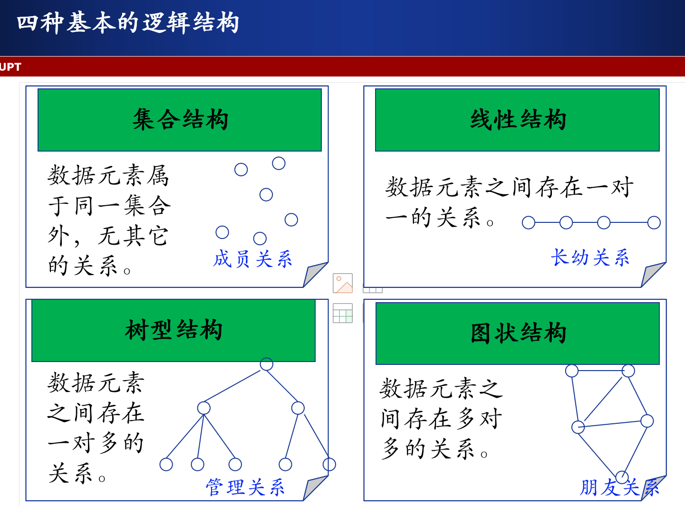

# 第一章 绪论

## 1.计算机硬件核心组成

### 存储器：

​	内存存储器，外存储器

### 中央处理器：

​	控制器：控制系统一步步从存储器中取出指令、译码

​	运算器：根据指令完成算术/逻辑运算

​	寄存器：保持程序运行状态、存储当前指令信息及下一条指令地址等

### 输入输出设备

---

## 2.**C 语言函数定义**和 作用域（可见性）

### 默认和` extern `的函数定义：

当你在任何一个 `.c` 文件中定义一个函数时，**如果没有加任何修饰符**（或显式地加上 `extern`），那么这个函数默认是 **`extern`** 的。

全局可见，可链接，可通过声明之后调用

### `static` 的函数定义：

**`static` 的含义：** 当 `static` 关键字用于函数定义时，它限制了该函数的**链接性 (Linkage)**。

即使你在其他文件里写了一个 `extern static fuction a();` 试图声明它，编译器在链接时也找不到它，因为它被限制在了它自己的文件内部。

---

##  3.`const` 声明与指针

### 核心判断法则：就近原则

> `const` 关键字修饰离它**最近**的那个对象。

- 如果 `const` 靠近 **类型 (Type)**，则修饰**对象 (Data)**，表示**对象只读**。
- 如果 `const` 靠近 **星号 (\*)** 或 **变量名 (Variable Name)**，则修饰**指针 (Pointer)**，表示**指针只读**。

###  五种声明的详细分析

| **声明 (Statement)**       | **const 位置**              | **含义拆解**                                            | **谁是只读 (Const)?**  |
| -------------------------- | --------------------------- | ------------------------------------------------------- | ---------------------- |
| **`const int *a;`**        | 在 `int` 前                 | `const` 修饰 `int`。`a` 是一个指向 `const int` 的指针。 | **指向的对象**只读     |
| **`int const *b;`**        | 在 `*` 前                   | `const` 修饰 `int`。`b` 是一个指向 `const int` 的指针。 | **指向的对象**只读     |
| **`int *c;`**              | 无 `const`                  | `c` 是一个普通的 `int` 指针。                           | **指针和对象都可读写** |
| **`const int * const d;`** | 1. 在 `int` 前 2. 在 `d` 前 | 1. `const` 修饰 `int`。 2. `const` 修饰 `d` (指针)。    | **指针和对象都只读**   |
| **`int const * const e;`** | 1. 在 `*` 前 2. 在 `e` 前   | 1. `const` 修饰 `int`。 2. `const` 修饰 `e` (指针)。    | **指针和对象都只读**   |

---

## 3.一些基本概念和术语

- **数据：**是客观事物的数字化表示，是被计算机加工处理的对象。

- **数据元素：**（记录、表目）  数据的基本单位，是数据集合中的一个个体。  

	  一个数据元素可由若干个**数据项**组成，数据项是不可分割的最小单位。

- **数据对象：**  是性质相同的数据元素的集合，是数据的一个子集。

### 数据结构包含——带结构的数据元素的集合：

1. 数据元素的集合

2. 元素之间的关系

3. 定义在元素上的运算

	数据结构=(D,S,Op)   其中：D为数据元素集合；S为D上的关系；Op为定义在D上的运算；

---

## 4.逻辑结构

数据元素之间的逻辑关系，与计算机无关。 逻辑结构 = (D,S)

# 第二章 线性表

