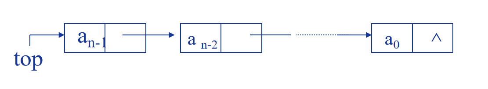
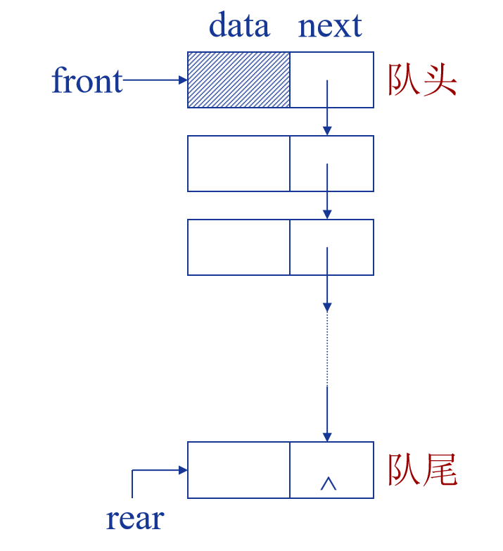
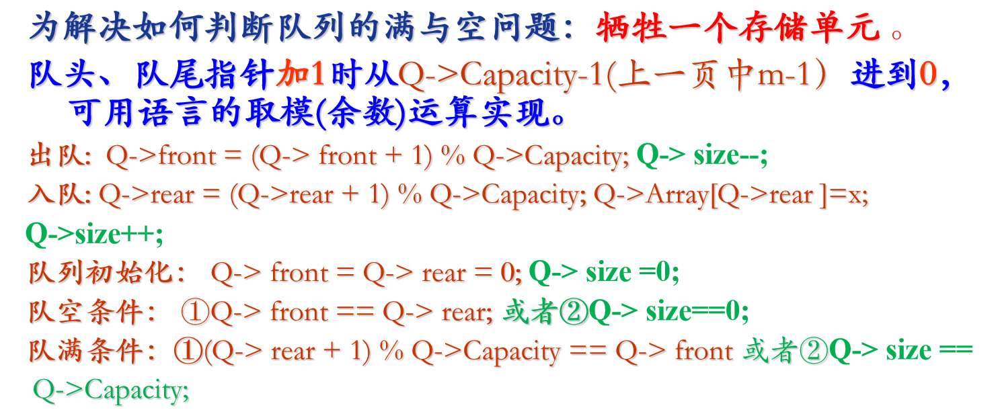
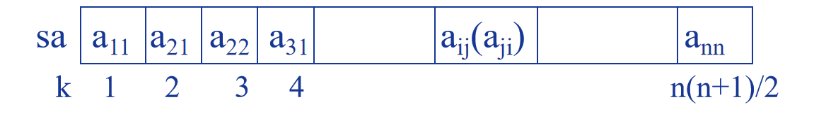
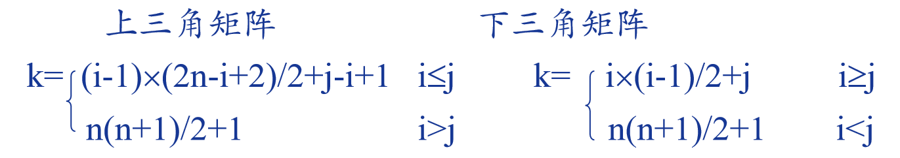
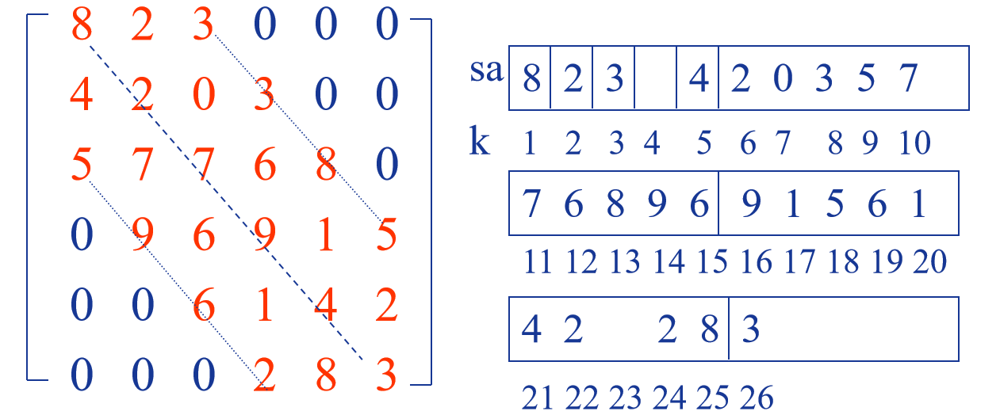
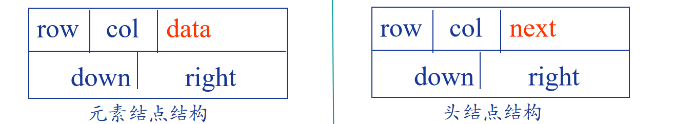

# 第一章 绪论


## 1.计算机硬件核心组成

### 存储器：

​	内存存储器，外存储器

### 中央处理器：

​	控制器：控制系统一步步从存储器中取出指令、译码

​	运算器：根据指令完成算术/逻辑运算

​	寄存器：保持程序运行状态、存储当前指令信息及下一条指令地址等

### 输入输出设备

---

## 2.**C 语言函数定义**和 作用域（可见性）

### 默认和` extern `的函数定义：

当你在任何一个 `.c` 文件中定义一个函数时，**如果没有加任何修饰符**（或显式地加上 `extern`），那么这个函数默认是 **`extern`** 的。

全局可见，可链接，可通过声明之后调用

### `static` 的函数定义：

**`static` 的含义：** 当 `static` 关键字用于函数定义时，它限制了该函数的**链接性 (Linkage)**。

即使你在其他文件里写了一个 `extern static fuction a();` 试图声明它，编译器在链接时也找不到它，因为它被限制在了它自己的文件内部。

---

##  3.`const` 声明与指针

### 核心判断法则：就近原则

> `const` 关键字修饰离它**最近**的那个对象。

- 如果 `const` 靠近 **类型 (Type)**，则修饰**对象 (Data)**，表示**对象只读**。
- 如果 `const` 靠近 **星号 (\*)** 或 **变量名 (Variable Name)**，则修饰**指针 (Pointer)**，表示**指针只读**。

###  五种声明的详细分析

| **声明 (Statement)**       | **const 位置**              | **含义拆解**                                            | **谁是只读 (Const)?**  |
| -------------------------- | --------------------------- | ------------------------------------------------------- | ---------------------- |
| **`const int *a;`**        | 在 `int` 前                 | `const` 修饰 `int`。`a` 是一个指向 `const int` 的指针。 | **指向的对象**只读     |
| **`int const *b;`**        | 在 `*` 前                   | `const` 修饰 `int`。`b` 是一个指向 `const int` 的指针。 | **指向的对象**只读     |
| **`int *c;`**              | 无 `const`                  | `c` 是一个普通的 `int` 指针。                           | **指针和对象都可读写** |
| **`const int * const d;`** | 1. 在 `int` 前 2. 在 `d` 前 | 1. `const` 修饰 `int`。 2. `const` 修饰 `d` (指针)。    | **指针和对象都只读**   |
| **`int const * const e;`** | 1. 在 `*` 前 2. 在 `e` 前   | 1. `const` 修饰 `int`。 2. `const` 修饰 `e` (指针)。    | **指针和对象都只读**   |

---

## 3.一些关于数据的基本概念和术语

- **数据：**是客观事物的数字化表示，是被计算机加工处理的对象。

- **数据元素：**（记录、表目）  数据的基本单位，是数据集合中的一个个体。  

	  一个数据元素可由若干个**数据项**组成，数据项是不可分割的最小单位。

- **数据对象：**  是性质相同的数据元素的集合，是数据的一个子集。

    例如：

    | **字段 (数据项)**          | **学号 (ID)** | **姓名 (Name)** | **年龄 (Age)** | **班级 (Class)** |
    | -------------------------- | ------------- | --------------- | -------------- | ---------------- |
    | **学生A的记录 (数据元素)** | 2023001       | 张三            | 18             | 软件1班          |
    | **学生B的记录 (数据元素)** | 2023002       | 李四            | 19             | 软件1班          |
    | ...                        | ...           | ...             | ...            | ...              |

    对上面这个表格来说：

    **1. 数据项 (Data Item):**

    - 指的是表格中的**最小列**，如“**学号**”、“**姓名**”、“**年龄**”等。
    - 它们是不可再分割的最小信息单位。

    **2. 数据元素 (Data Element):**

    - 指的是表格中的**一行**，即一个完整的“**学生记录**”（如：张三，2023001，18岁，软件1班）。
    - 它是数据的基本单位，由多个数据项组成。

    **3. 数据对象 (Data Object):**

    - 指的是**性质相同的**所有数据元素的集合。在这个例子中，就是**所有学生的记录**（即表格中所有的行）的集合。

    **4. 数据 (Data):**

    - 指的是所有这些被计算机处理的客观事物的数字化表示。在这个例子中，**整个“学生信息表”文件及其内容**，就是我们所说的**数据**。

### 数据结构包含——带结构的数据元素的集合：

1. 数据元素的集合

2. 元素之间的关系

3. 定义在元素上的运算

	数据结构=(D,S,Op)   其中：D为数据元素集合；S为D上的关系；Op为定义在D上的运算；

---

## 4.逻辑结构

数据元素之间的逻辑关系，与计算机无关。 逻辑结构 = (D,S)


---

## 5.存储结构

### 存储结构（物理结构）：指数据的逻辑结构在计算机存储器中的映象表示。

数据元素的映象 ：用二进制位(bit)的位串表示数据元素。           

​	每个数据元素的映象称为结点           

​	每个数据项的映象称为数据域

### 四种不同的存储结构

1. 顺序存储结构2.	链式存储结构3.	哈希存储结构	 4.	索引存储结构 

---

## 6.算法评估

- ### 复杂度度量：

	**时间复杂度：**主要在于运行时间。程序步：语法上或语义上有意义的一段指令序列。执行时间与实例特性无关例如：  

	注释：程序步数为0 

	声明语句：程序步数为0  

	简单语句：表达式/赋值/打印等，程序步为1

	复杂语句或函数调用：换算成简单语句再计算

	**空间复杂度：**

	存储空间的**固定**部分

	程序指令代码的空间，常数、简单变量、定长成分(如数组元素、结构成分、对象的数据成员等)变量所占的空间

	**可变部分**

	尺寸与实例特性有关的成分变量所占空间、引用变量所占空间、递归栈所用的空间、通过new和delete命令动态使用的空间	

- ### 复杂度计算：

	


---

# 第二章 线性表

## 1.链表

- ### 带头结点dummy作用：

	插入和删除第一个数据元素时不必对头指针进行特殊处理。

- ### 带头节点的单链表的生成（头插法和尾插法）：

	头插法的时间复杂度为$O(n)$

	尾插法的时间复杂度为$O(n^2)$

- ### 单循环链表特点:

	是单链表的变形。

	最后一个结点的后继指针不为 0 (NULL)，而是指向了表的前端。

	为简化操作，**在单循环链表中往往加入表头结点**。

	只要知道表中某一结点的地址，就可搜寻到所有其他结点的地址。

---

## 2.顺序表和单链表比较

> ### 顺序表：
>
> - 空间：
>
> 	存储空间静态分配，需事先确定
>
> 	存储密度高(d=1) (不考虑空闲区)
>
> - 时间：
>
> 	是随机存取结构，可以根据序号直接定位
>
> 	插入/删除结点操作时数据元素要移动

> ### 单链表：
>
> - 空间：
>
> 	存储空间动态分配，可以按需要使用
>
> 	每一结点附加指针域(d<1)
>
> - 时间：
>
> 	是非随机存取结构，定位需从头指针扫描
>
> 	插入/删除结点操作时通常只要修改指针

---

# 第三章 栈和队列

## 1.入栈出栈序列：

n个元素依次入栈，可得到多少个合法的出栈序列：**$\dfrac{(2n)!}{(n+1)!*n!}$**

思考方法：因为n个元素的入栈和出栈顺序是固定的，所以用0代表元素出栈，1为入栈，只需满足一个序列中任意一个位置，前面的1的个数要大于等于0的个数

---

## 2.多栈操作 栈浮动技术：

$n$栈共享一个数组空间$V[m]$

设立栈顶指针数组$t[n+1]$和栈底指针数组$b[n+1]$

$t[i]$和$b[i]$分别指示第i个栈的栈顶与栈底   

$b[n]$作为控制量，指到数组最高下标

各栈初始分配空间 $s =\lfloor m / n\rfloor$

指针初始值  $t[0] = b[0] = -1 ,  b[n] = m-1$ 

 $t[i] = b[i] = b[i-1] + s,   i = 1, 2, …, n-1$

---

## 3.链栈：



链栈特点：

链式栈无栈满问题，空间可扩充

插入与删除**仅在栈顶处执行**

链式栈的**栈顶在链头**

适合于**多栈操作**

---

## 4.链队列：



类型定义：队头指针+队尾指针

- 队头在链头，队尾在链尾
- 链式队列在进队时无队满问题，但有队空问题
- 队空条件为    ` front ->next== NULL `

---

## 5.循环队列

- 一般顺序存储队列的缺陷：出队列操作后大量移动数据或存在“假上溢”现象：即存在空闲空间但无法入队。

可以通过循环队列提高空间利用率

【类型定义】：队列空间（数组）+队头指针+队尾指针

队头指针front指向队头元素的**前一位置**，而队尾指针rear指向队尾元素

优点：不需要移动元素，操作效率高，空间的利用率也很高。



---

## 6.双端队列

限定插入和删除操作在线性表的两端进行。

可以将它看成是栈底连在一起的两个栈，但它与两个栈共享存储空间是不同的。共享存储空间中的两个栈的栈顶指针是向两端扩展的，因而每个栈只需一个指针；而双端队列允许两端进行插入和删除元素，因而每个端点必须设立两个指针。

- 实际应用时的双端（特殊）队列：

	输出受限的双端队列（即一个端点允许插入和删除，另一个端点只允许插入）

	输入受限的双端队列（即一个端点允许插入和删除，另一个端点只允许删除）

	如果限定双端队列从某个端点插入的元素只能从该端点删除，则双端队列就蜕变为两个栈底相邻接的栈了

---

# 第四章 字符串和模式匹配

```


```


---

# 第五章 数组和广义表

## 1.数组和线性表的联系：

- 元素都具有统一的类型
- 可以认为，d维数组的非边界元素具有d个直接前趋和d个直接后继（线性表则只有一个前驱和后驱）
- 数组维数确定后，数据元素个数和元素之间的关系不再发生改变，适合于顺序存储
- 每组有定义的下标都存在一个与其相对应的值

---

## 2.数组的随机存储结构：

**随机存取 (Random Access)** 是数组最重要的特性之一。

- **定义：** 随机存取是指对数据结构中的**任意一个元素**进行访问所需的时间与该元素在结构中的**位置无关**，是**常数时间**。
- **数组的实现：** 正如上面展示的，无论元素 $A[i_1, i_2, \dots, i_d]$ 在数组的**开头、中间还是末尾**，我们都可以通过地址公式 $Loc(\dots)$，经过**有限次（常数次）的乘法、加法和减法运算**，直接计算出它的物理存储地址。
- **时间复杂度：** 因此，访问数组中任意元素的时间复杂度是 $O(1)$。
- **对比：** 相比之下，链表是**顺序存取**结构，要访问第 $k$ 个元素，必须从头开始遍历 $k$ 次，时间复杂度是 $O(k)$。

---

## 3.多维数组的表示：

①定义和引用多维数组的唯一方法就是使用**数组的数组**。即多维数组看成是某种对象的一维数组，数组的元素可以是另一个数组。

②C语言定义多维数组时，最右边的下标先变化，即行优先顺序。

③C语言中任何一维数组均可作为函数的实参，但**无法向函数传递普通的多维数组**。这是因为我们需要知道每一维的长度，为地址运算提供正确的单位长度。因此**必须提供除最左边一维外的所有维的长度**，把**实参限制在除最左边一维外的所有维都必须与形参匹配的数组**。

例如：

定义函数时可以用$fun (int\ a[\  ][3][5])$,除了最左边的长度之外都得写明

---

## 4.矩阵的压缩存储：

- ###  对称矩阵

	满足对称性的话，只存储下(或者上)三角(包括主对角线)的数据元素。共占用n(n+1)/2个元素空间

	利用数组直接存储



- ### 三角矩阵

	- 特点：对角线以下(或者以上)的数据元素(不包括对角线)全部为常数c。

	- 存储方法：重复元素c共享一个元素存储空间，共占用n(n+1)/2+1个元素空间。



- ### 带状矩阵（对角矩阵）

	- 特点：在$n*n$的方阵中，非零元素集中在**主对角线及其两侧共L(奇数)条对角线的带状区域内** — 称为：L对角矩阵。
	- 存储方法：
		1. 只存储带状区内的元素，存储顺序为以对角线的顺序，从上到下存储
		2. 只存储带状区内的元素。除首行和末行，按每行 L个元素，共(n-2)L+(L+1)个元素。



- ### 稀疏矩阵

	- 特点：大多数元素为零

	- 存储方法：记录每一非零元素$(i,j,a_{ij} )$ —节省空间，但丧失随机存取功能

		- 顺序存储：三元组表

			==利用三元组表实现矩阵的快速转置==

			三元组表的数据结构基本定义：

			```c
			#define u={矩阵中非零元素最大个数};
			    
			typedef struct  tuple 
			{
			    int i,j;
			    elemtype v;
			} TupleNode;
			    
			struct sparmattp
			{
			    int m,n,t; \\m:行数; n:列数; t:非零元素数目
			   TupleNode data[1..u];                                
			}
			     
			typedef struct sparmattp TSMatrix;
				
			```

			在此基础上加两个辅助向量：

			```c
			num[1,..,a.n]：a中每列的非零元素个数
			cpot[1,..,a.n]：a中每列的第一个非零元素在b中的位置
			```

			然后再按列计算A转置之后到B的位置：

			1. 取出 $A$ 中的元素 $a[k] = (i, j, v)$。

			2. 查找 $j$ 对应的起始位置 $cpot[j]$。

			3. 将转置元素 $(j, i, v)$ 存入 $B$ 的 $cpot[j]$ 位置。

			4. 将 $cpot[j]$ **递增 1**，为 $A$ 中下一个属于第 $j$ 列的元素准备位置。

			```c
			void fast_transpos(TSMatrix a, TSMatrix b)
			{
			    b.m=a.n;  b.n=a.m;  b.t=a.t;
			    if (b.t >0)
			    {    
			            for(col=1;col<=a.n;col++)
					      num[col]=0;       {num清零}
			            for (t=1;t<=a.t;t++)                {对a.t个非零元素}
			                 num[a.data[t].j]=num[a.data[t].j]+1; ｛按列号计数｝            
			            cpot[1]=1;                                            {生成cpot} 
			            for (col=2; col<=a.n;col++)
					      cpot[col]=cpot[col-1]+num[col-1];
			            for (p=1; p<= a.t; p++)           {对a.t个非零元素转置}
				      {            
			                    col=a.data[p].j;   q=cpot[col];
			                    b.data[q].i=a.data[p].j;
			                    b.data[q].j=a.data[p].i;
			                    b.data[q].v=a.data[p].v;
			                    cpot[col]=cpot[col]+1;
			             }
			     }
			}
			
			```

		- 链式存储：十字（正交）链表

			存储特点：在行、列两个方向上，将非零元素链接在一起。克服三元组表在矩阵的非零元素位置或个数经常变动时的使用不便。

			存储结构：

			

			```c
			//十字链表结点结构
			typedef struct mtxn
			{
			    int row, col; //行号，列号
			    struct mtxn *right, *down;
			    union
			    {
			         int data;
			         struct mtxn * next;
			    }
			}
			```

---

# 第六章 树与二叉树

